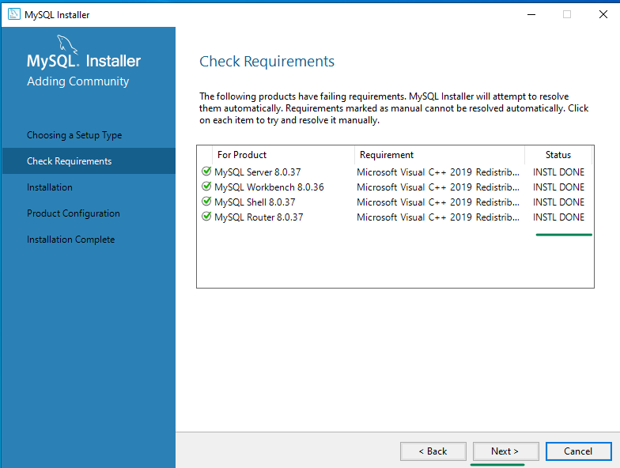

## Install Mysql Server and Mysql Workbench in your Windows Laptop

From this link download the msi installer and install it following this guide.  
[https://cdn.mysql.com//Downloads/MySQLInstaller/mysql-installer-community-8.0.37.0.msi](https://cdn.mysql.com//Downloads/MySQLInstaller/mysql-installer-community-8.0.37.0.msi)

> the root password can be anything but lets keep it consistent for easy working  

| **Username**  | **Password**                      |
| ------------- | --------------------------------- |
| root(default) | `DBpassword@1234` (my preference) |


### After logging in to the mysql workbench make sure to create a database with name `devops_db`


<hr>
  

<hr>
  

<hr>
  

<hr>
  

<hr>
  

<hr>
  

<hr>
  

<hr>
  

<hr>
  

<hr>
  

<hr>
  

<hr>
  

<hr>
  

<hr>
  

<hr>
  

<hr>
  

<hr>
  

<hr>
  

<hr>
  

<hr>
  

<hr>
  

<hr>
  

<hr>
  

<hr>
  

<hr>
  

<hr>
  

<hr>
  

<hr>
  

<hr>
  

<hr>
  

### this is for educational purposes don't execute table commands since spring boot will take of it, MAKE SURE DB EXISTS.
```sql
-- Script to set up db for spring
create database devops_db;
use devops_db;
-- this is done automatically by spring jpa if the db exists
-- Create a table for student
CREATE TABLE IF NOT EXISTS `student` (
    `id` INT AUTO_INCREMENT PRIMARY KEY,
    `roll_no` VARCHAR(20) UNIQUE NOT NULL,
    `branch` VARCHAR(50),
    `full_name` VARCHAR(255) NOT NULL,
    `email` VARCHAR(255) NOT NULL,
    `phone_number` VARCHAR(10)
);
INSERT INTO `student` (`roll_no`, `branch`, `full_name`, `email`, `phone_number`)
VALUES
    ('1234500001', 'Chemical Engineering', 'David Miller', 'david.miller@example.com', '7775551234'),
    ('1234500002', 'Biomedical Engineering', 'Emily Davis', 'emily.davis@example.com', '1112223344'),
    ('1234500003', 'Aerospace Engineering', 'Michael Wilson', 'michael.wilson@example.com', '9998887777'),
    ('1234500004', 'Information Technology', 'Olivia Brown', 'olivia.brown@example.com', '3334445555'),
    ('1234500005', 'Electronics and Communication', 'William Taylor', 'william.taylor@example.com', '6667778888'),
    ('1234500006', 'Environmental Engineering', 'Sophia Lee', 'sophia.lee@example.com', '2223334444'),
    ('1234500007', 'Industrial Engineering', 'Ethan Hernandez', 'ethan.hernandez@example.com', '7776665555'),
    ('1234500008', 'Materials Science', 'Ava Jackson', 'ava.jackson@example.com', '5554443333'),
    ('1234500009', 'Petroleum Engineering', 'Liam Garcia', 'liam.garcia@example.com', '4443332222'),
    ('1234500010', 'Civil Engineering', 'Emma White', 'emma.white@example.com', '8887776666');

```
