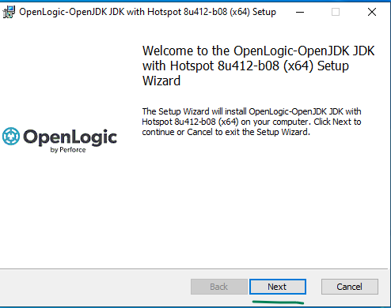
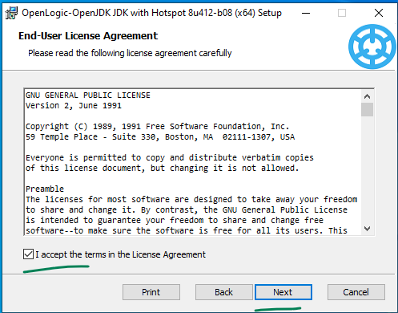
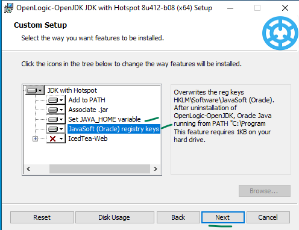
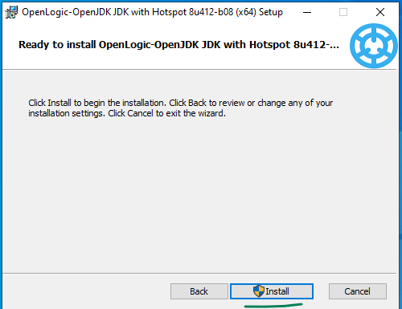
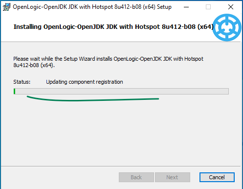
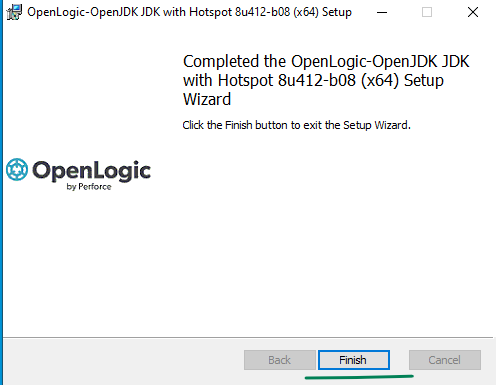
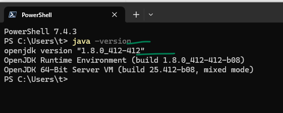

## Install OpenJDK8 in your Windows Laptop

From this link download the msi installer and install it following this guide.   
[https://builds.openlogic.com/downloadJDK/openlogic-openjdk/8u412-b08/openlogic-openjdk-8u412-b08-windows-x64.msi](https://builds.openlogic.com/downloadJDK/openlogic-openjdk/8u412-b08/openlogic-openjdk-8u412-b08-windows-x64.msi)

  

  

  

  

  

  

  