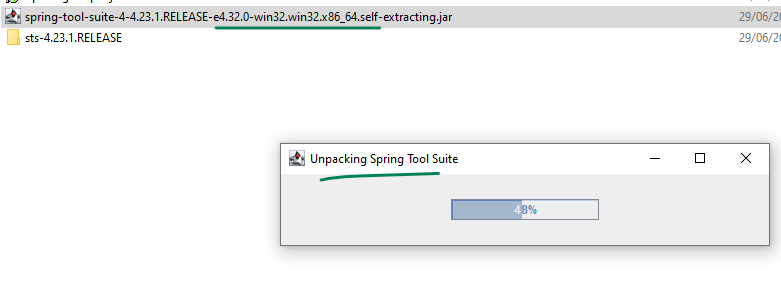
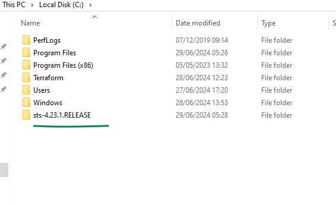
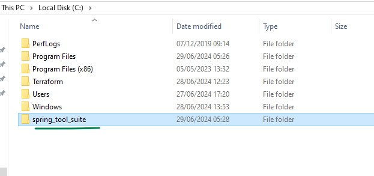
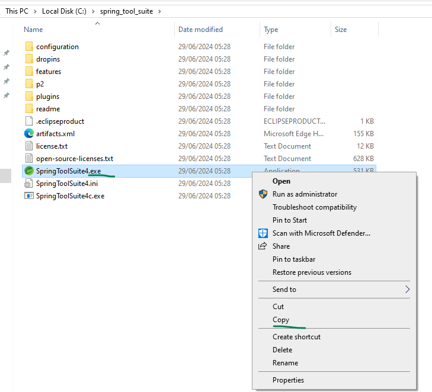
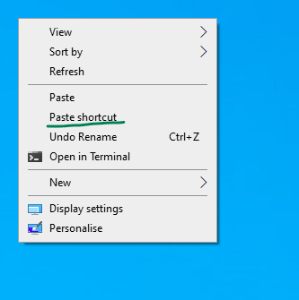
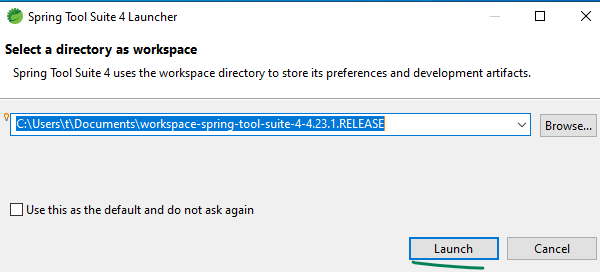
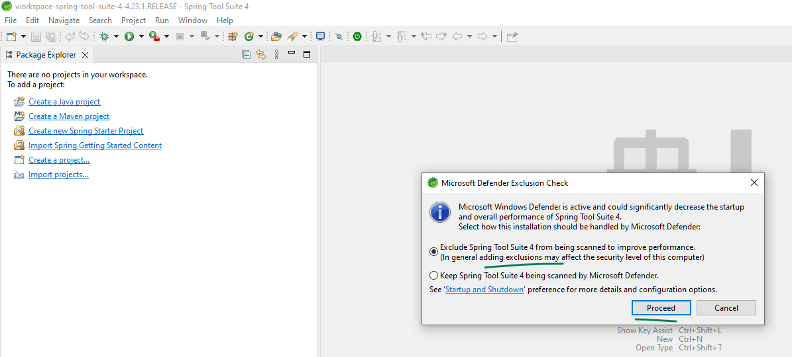

## Install Spring Tool Suite in your Windows Laptop

From this link download the jar installer  
[https://cdn.spring.io/spring-tools/release/STS4/4.23.1.RELEASE/dist/e4.32/spring-tool-suite-4-4.23.1.RELEASE-e4.32.0-win32.win32.x86_64.self-extracting.jar](https://cdn.spring.io/spring-tools/release/STS4/4.23.1.RELEASE/dist/e4.32/spring-tool-suite-4-4.23.1.RELEASE-e4.32.0-win32.win32.x86_64.self-extracting.jar)

  

  

  

  

  

  

  

  
