## Install Node JS LTS in your Windows Laptop

From this link download the installer and install here.   
[https://nodejs.org/dist/v20.15.0/node-v20.15.0-x64.msi](https://nodejs.org/dist/v20.15.0/node-v20.15.0-x64.msi)

### If taking too long at visual studio then press CTRL+C in powershell which will exit that.

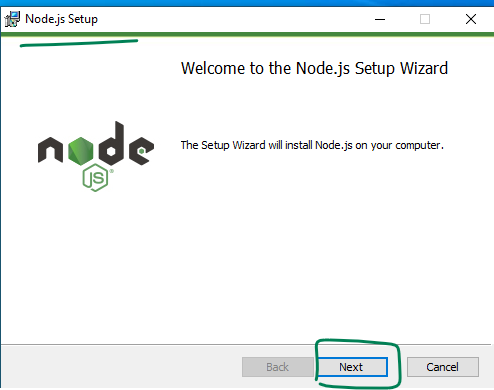

  
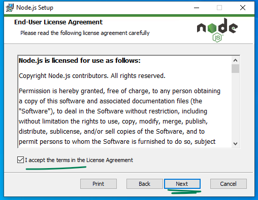

  
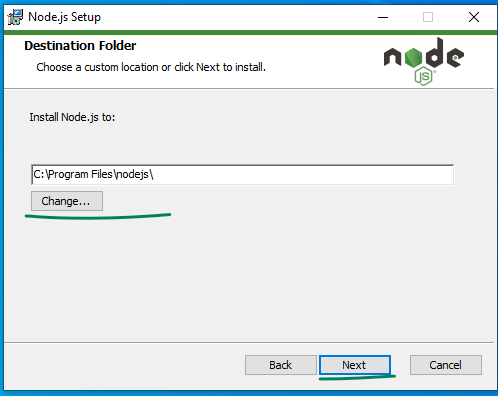

  
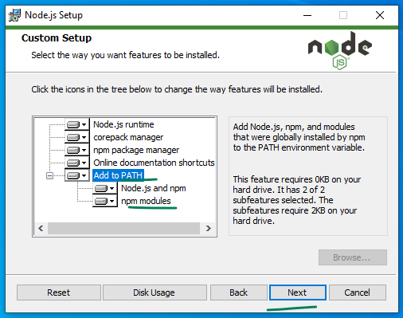

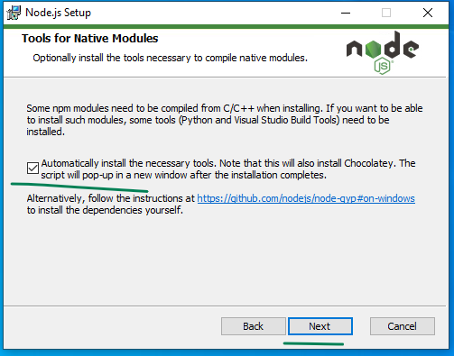

  
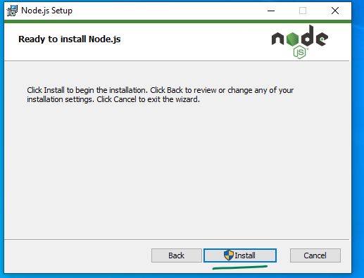

  
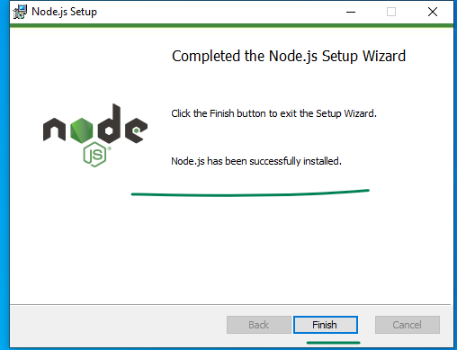

  
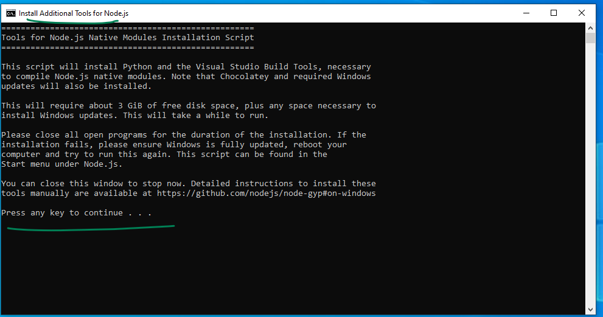

  
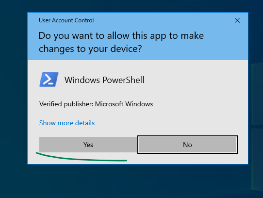

  
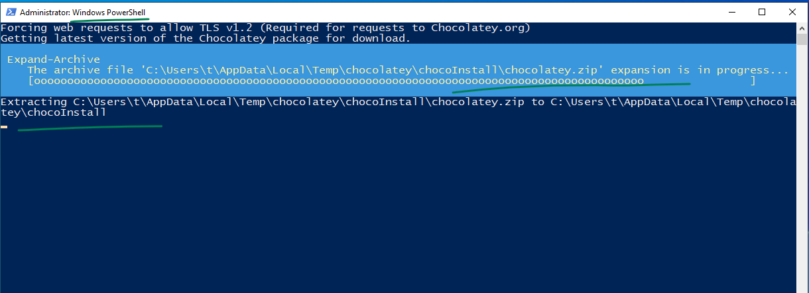

  
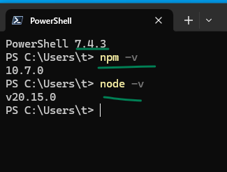

  
