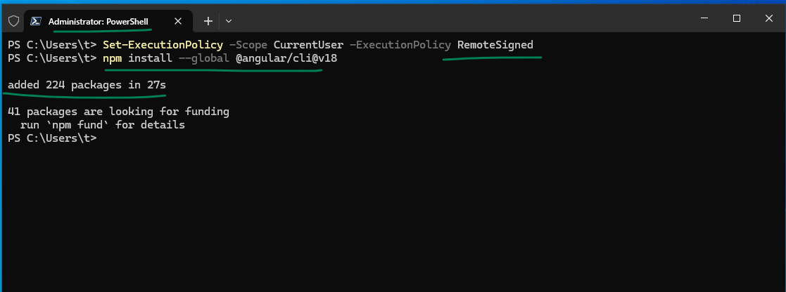
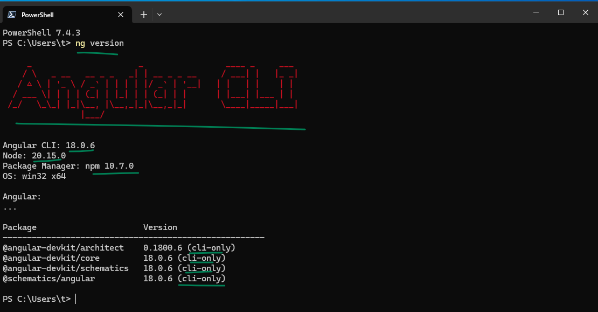

## Install Angular 18

### to install angular run in command in your local terminal with `run as administrator`
```bash
Set-ExecutionPolicy -Scope CurrentUser -ExecutionPolicy RemoteSigned
npm install --global @angular/cli@v18

# verify the version with this.
ng -version
```


<hr>
  

<hr>
  
