## Lets create a new spring boot api that Performs CRUD operations on the mysql server we have installed.

Usually we create a spring project https://start.spring.io/ by creating a starter project and importing in our STS tool.   
 
But as most companies and enterprise grade softwares are still stuck with JAVA JDK 8 for legacy code and still maintaining it till 2030, we will use a manual spring boot project to simulate that.  

### To simplify, i already have all the source code and config in this git repo, you can clone in your local and use     
[https://github.com/Professor-Paradox/spring-boot-crud-api](https://github.com/Professor-Paradox/spring-boot-crud-api)  

1. open terminal in a folder of your choice(desktop git folder) where you can store this spring boot project
2. clone the repo and import in sts 
3. check if the project is using java 8 or not in the project properties
4. click on `run as` and select maven clean and maven install to download project dependencies
5. make sure to have the mysql workbench started and a database with name `devops_db` is already created, we use that db to put all data.
6. run the project as spring boot application
7. once application starts test the api with postman api or curl.

### [View this page for api testing](../01_validate_api/index.md)

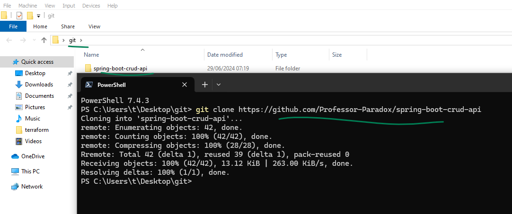 

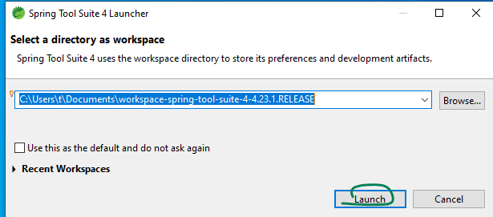 

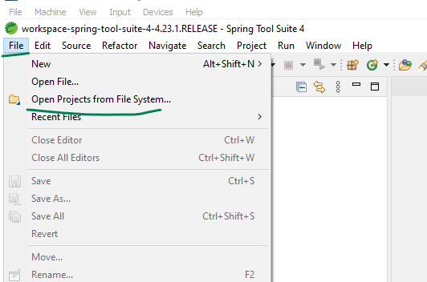 

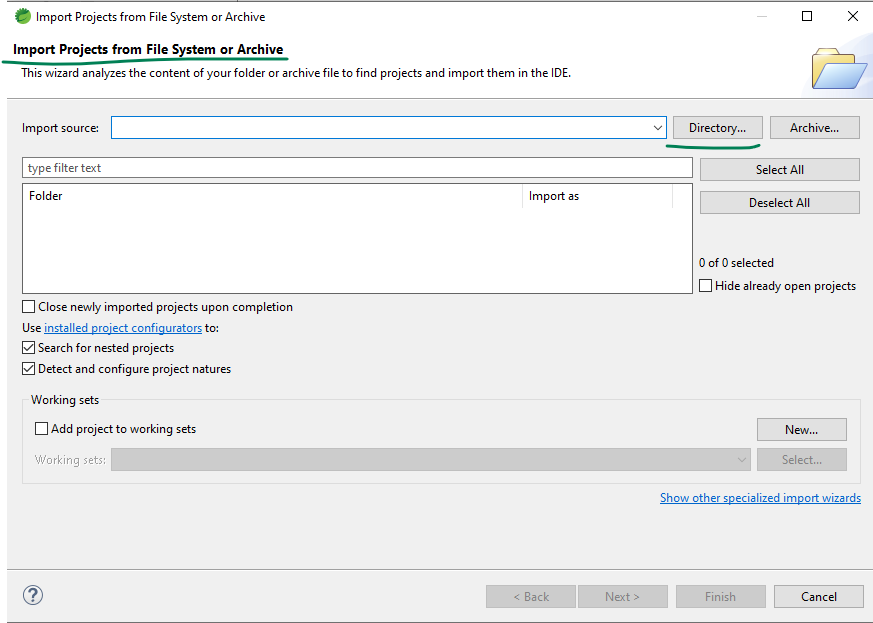 

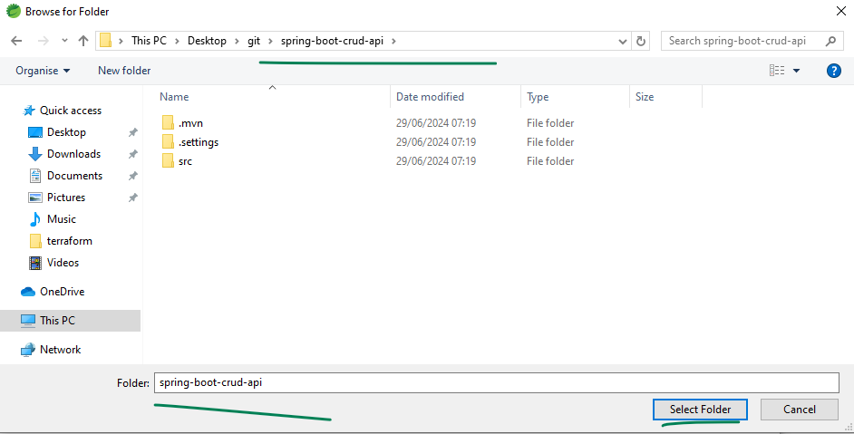 

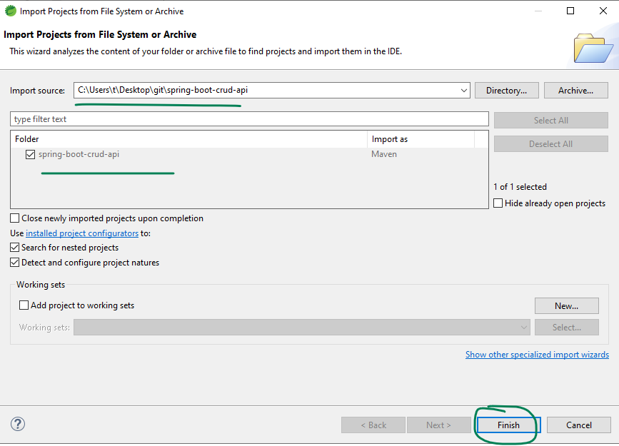 

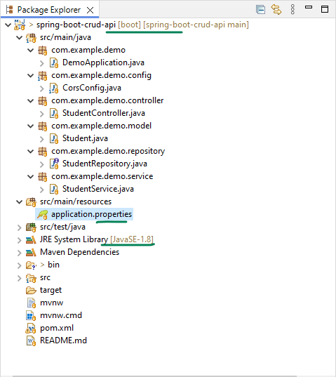 

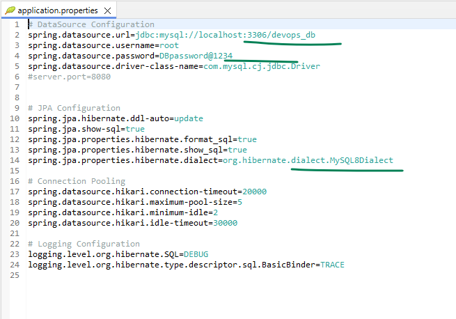 

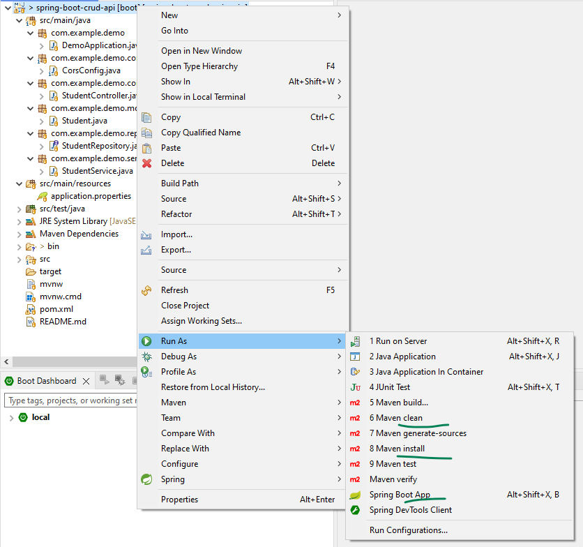 

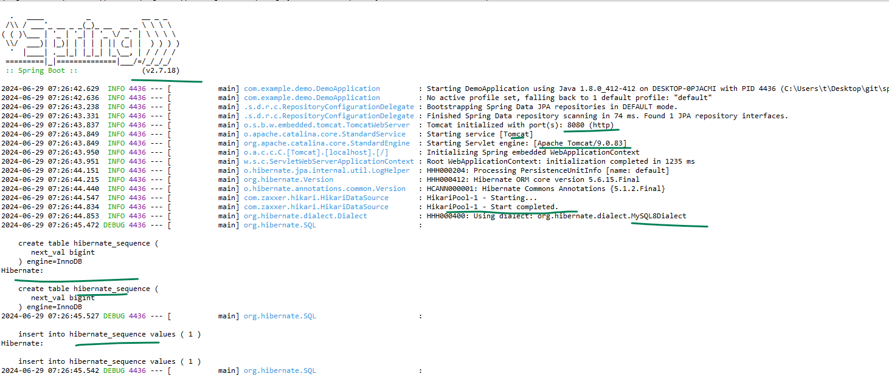 

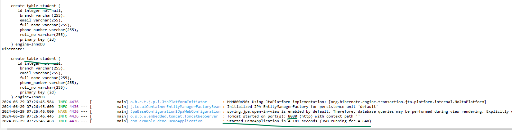 

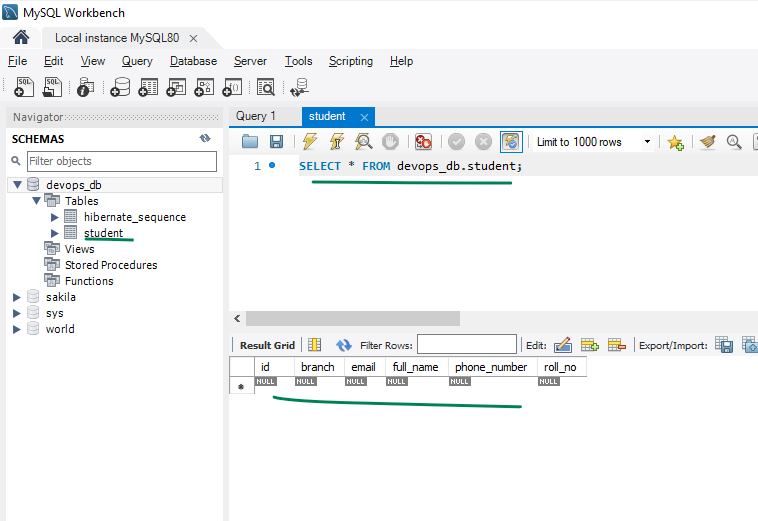 

