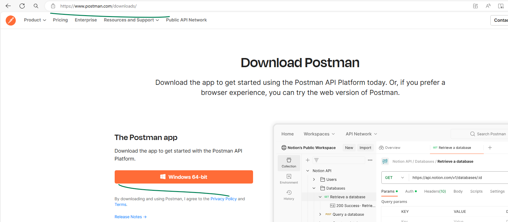
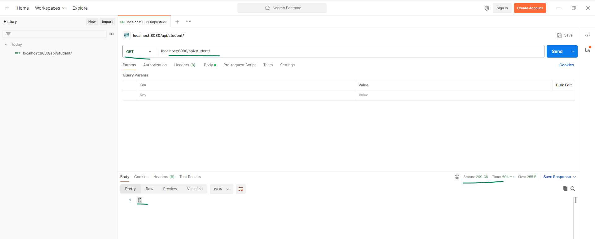
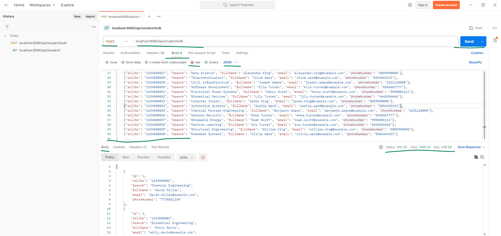
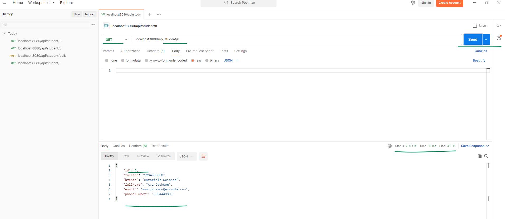
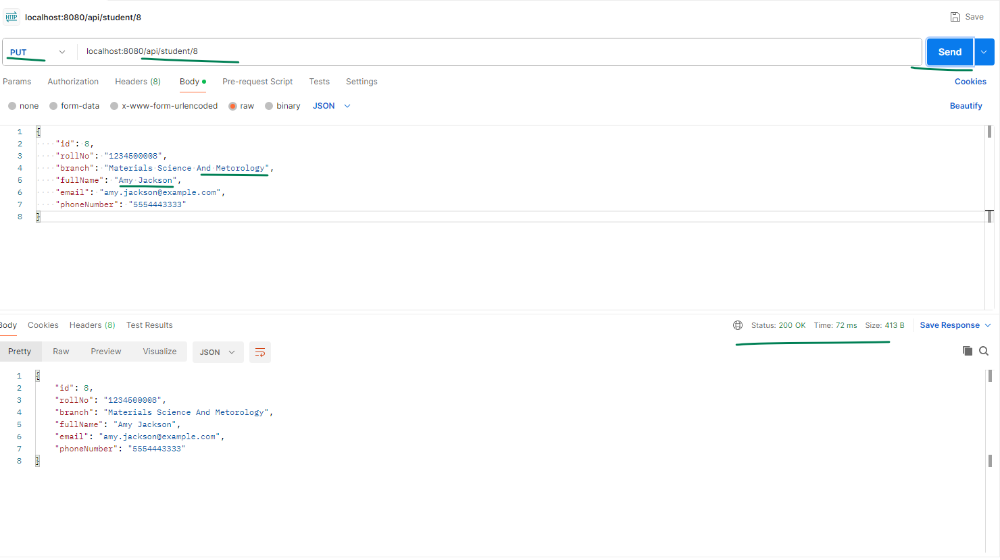
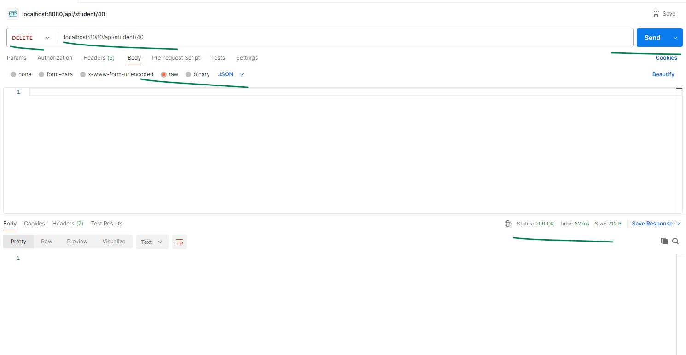
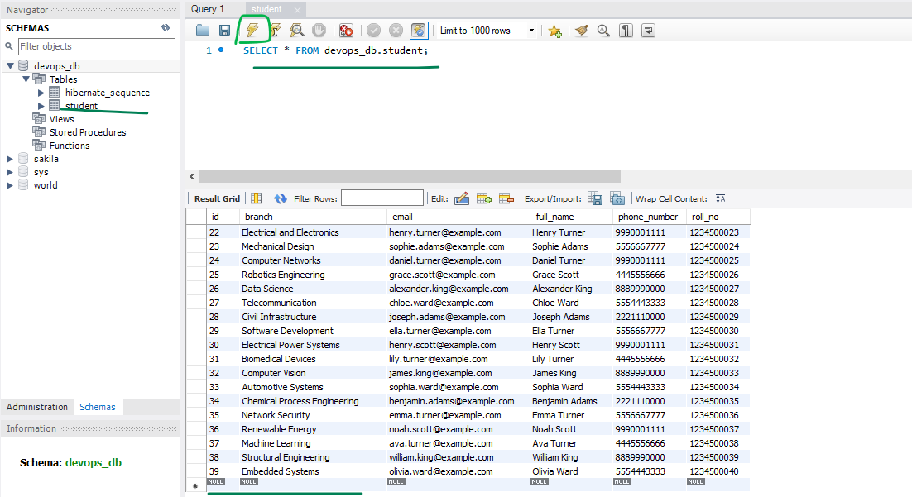

## Lets Validate this spring boot api that Performs CRUD operations with a tool called Postman

Visit [https://www.postman.com/downloads/](https://www.postman.com/downloads) and download the postman installer for windows and install it.

1. open postman and enter the url `localhost:8080/api/student` this is our base api
2. now performa `GET, POST, PUT, DELETE` operations to this url with different api endpoints

 
<hr>

* run `get` operation with '/' endpoint which should give [] empty array as the output


<hr>

* run `post` operation with '/bulk' endpoint of base and provide all the below json data in raw json data to insert multiple students data at the same time, 
    * this is the data we are using to put in the database with the api.

```json
[
    {"rollNo": "1234500001", "branch": "Chemical Engineering", "fullName": "David Miller", "email": "david.miller@example.com", "phoneNumber": "7775551234"},
    {"rollNo": "1234500002", "branch": "Biomedical Engineering", "fullName": "Emily Davis", "email": "emily.davis@example.com", "phoneNumber": "1112223344"},
    {"rollNo": "1234500003", "branch": "Aerospace Engineering", "fullName": "Michael Wilson", "email": "michael.wilson@example.com", "phoneNumber": "9998887777"},
    {"rollNo": "1234500004", "branch": "Information Technology", "fullName": "Olivia Brown", "email": "olivia.brown@example.com", "phoneNumber": "3334445555"},
    {"rollNo": "1234500005", "branch": "Electronics and Communication", "fullName": "William Taylor", "email": "william.taylor@example.com", "phoneNumber": "6667778888"},
    {"rollNo": "1234500006", "branch": "Environmental Engineering", "fullName": "Sophia Lee", "email": "sophia.lee@example.com", "phoneNumber": "2223334444"},
    {"rollNo": "1234500007", "branch": "Industrial Engineering", "fullName": "Ethan Hernandez", "email": "ethan.hernandez@example.com", "phoneNumber": "7776665555"},
    {"rollNo": "1234500008", "branch": "Materials Science", "fullName": "Ava Jackson", "email": "ava.jackson@example.com", "phoneNumber": "5554443333"},
    {"rollNo": "1234500009", "branch": "Petroleum Engineering", "fullName": "Liam Garcia", "email": "liam.garcia@example.com", "phoneNumber": "4443332222"},
    {"rollNo": "1234500010", "branch": "Civil Engineering", "fullName": "Emma White", "email": "emma.white@example.com", "phoneNumber": "8887776666"},
    {"rollNo": "1234500011", "branch": "Computer Science", "fullName": "Noah Martinez", "email": "noah.martinez@example.com", "phoneNumber": "2221110000"},
    {"rollNo": "1234500012", "branch": "Mechanical Engineering", "fullName": "Isabella Adams", "email": "isabella.adams@example.com", "phoneNumber": "5556667777"},
    {"rollNo": "1234500013", "branch": "Electrical Engineering", "fullName": "James Harris", "email": "james.harris@example.com", "phoneNumber": "9990001111"},
    {"rollNo": "1234500014", "branch": "Software Engineering", "fullName": "Mia Robinson", "email": "mia.robinson@example.com", "phoneNumber": "4445556666"},
    {"rollNo": "1234500015", "branch": "Biotechnology", "fullName": "Benjamin Turner", "email": "benjamin.turner@example.com", "phoneNumber": "7778889999"},
    {"rollNo": "1234500016", "branch": "Automobile Engineering", "fullName": "Charlotte Hall", "email": "charlotte.hall@example.com", "phoneNumber": "1112223333"},
    {"rollNo": "1234500017", "branch": "Chemistry", "fullName": "Daniel Lewis", "email": "daniel.lewis@example.com", "phoneNumber": "6667778888"},
    {"rollNo": "1234500018", "branch": "Mathematics", "fullName": "Grace Young", "email": "grace.young@example.com", "phoneNumber": "3334445555"},
    {"rollNo": "1234500019", "branch": "Physics", "fullName": "Alexander Scott", "email": "alexander.scott@example.com", "phoneNumber": "8889990000"},
    {"rollNo": "1234500020", "branch": "Environmental Science", "fullName": "Chloe King", "email": "chloe.king@example.com", "phoneNumber": "5554443333"},
    {"rollNo": "1234500022", "branch": "Computer Engineering", "fullName": "Ella Adams", "email": "ella.adams@example.com", "phoneNumber": "5556667777"},
    {"rollNo": "1234500023", "branch": "Electrical and Electronics", "fullName": "Henry Turner", "email": "henry.turner@example.com", "phoneNumber": "9990001111"},
    {"rollNo": "1234500024", "branch": "Mechanical Design", "fullName": "Sophie Adams", "email": "sophie.adams@example.com", "phoneNumber": "5556667777"},
    {"rollNo": "1234500025", "branch": "Computer Networks", "fullName": "Daniel Turner", "email": "daniel.turner@example.com", "phoneNumber": "9990001111"},
    {"rollNo": "1234500026", "branch": "Robotics Engineering", "fullName": "Grace Scott", "email": "grace.scott@example.com", "phoneNumber": "4445556666"},
    {"rollNo": "1234500027", "branch": "Data Science", "fullName": "Alexander King", "email": "alexander.king@example.com", "phoneNumber": "8889990000"},
    {"rollNo": "1234500028", "branch": "Telecommunication", "fullName": "Chloe Ward", "email": "chloe.ward@example.com", "phoneNumber": "5554443333"},
    {"rollNo": "1234500029", "branch": "Civil Infrastructure", "fullName": "Joseph Adams", "email": "joseph.adams@example.com", "phoneNumber": "2221110000"},
    {"rollNo": "1234500030", "branch": "Software Development", "fullName": "Ella Turner", "email": "ella.turner@example.com", "phoneNumber": "5556667777"},
    {"rollNo": "1234500031", "branch": "Electrical Power Systems", "fullName": "Henry Scott", "email": "henry.scott@example.com", "phoneNumber": "9990001111"},
    {"rollNo": "1234500032", "branch": "Biomedical Devices", "fullName": "Lily Turner", "email": "lily.turner@example.com", "phoneNumber": "4445556666"},
    {"rollNo": "1234500033", "branch": "Computer Vision", "fullName": "James King", "email": "james.king@example.com", "phoneNumber": "8889990000"},
    {"rollNo": "1234500034", "branch": "Automotive Systems", "fullName": "Sophia Ward", "email": "sophia.ward@example.com", "phoneNumber": "5554443333"},
    {"rollNo": "1234500035", "branch": "Chemical Process Engineering", "fullName": "Benjamin Adams", "email": "benjamin.adams@example.com", "phoneNumber": "2221110000"},
    {"rollNo": "1234500036", "branch": "Network Security", "fullName": "Emma Turner", "email": "emma.turner@example.com", "phoneNumber": "5556667777"},
    {"rollNo": "1234500037", "branch": "Renewable Energy", "fullName": "Noah Scott", "email": "noah.scott@example.com", "phoneNumber": "9990001111"},
    {"rollNo": "1234500038", "branch": "Machine Learning", "fullName": "Ava Turner", "email": "ava.turner@example.com", "phoneNumber": "4445556666"},
    {"rollNo": "1234500039", "branch": "Structural Engineering", "fullName": "William King", "email": "william.king@example.com", "phoneNumber": "8889990000"},
    {"rollNo": "1234500040", "branch": "Embedded Systems", "fullName": "Olivia Ward", "email": "olivia.ward@example.com", "phoneNumber": "5554443333"}
]
```


<hr>

* run `get` operation with '/{id}' student id to retrive the json data of the student with that unique id.


<hr>

* run `put` operation with '/{id}' student id and pass the entire object of the student with modified data to update the student data.


<hr>

* run `delete` operation with '/{id}' student id to delete that object from db.


<hr>


* Validate that the api is sending data to Database 

<hr>
