## Lets create Front end ui with angular and Create a Data table that uses the Spring API we created.

For this we will need to learn **HTML, CSS, JS, TS** and then create Angular Components.  

### To simplify, i already have all the source code and config in this git repo, you can clone in your local and use     
[https://github.com/Professor-Paradox/angular-data-table-ui](https://github.com/Professor-Paradox/angular-data-table-ui)  

## [Install VScode](./install_vscode.md)

## Execute angular Project

1. open terminal in a folder of your choice(desktop git folder) where you can store this angular project
2. clone the repo and import in vscode or editor of your choice

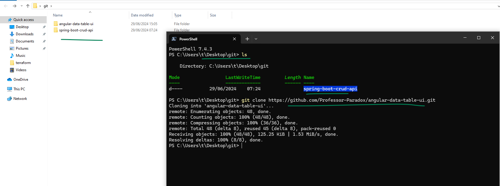 

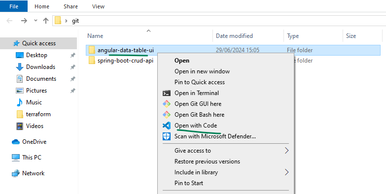 

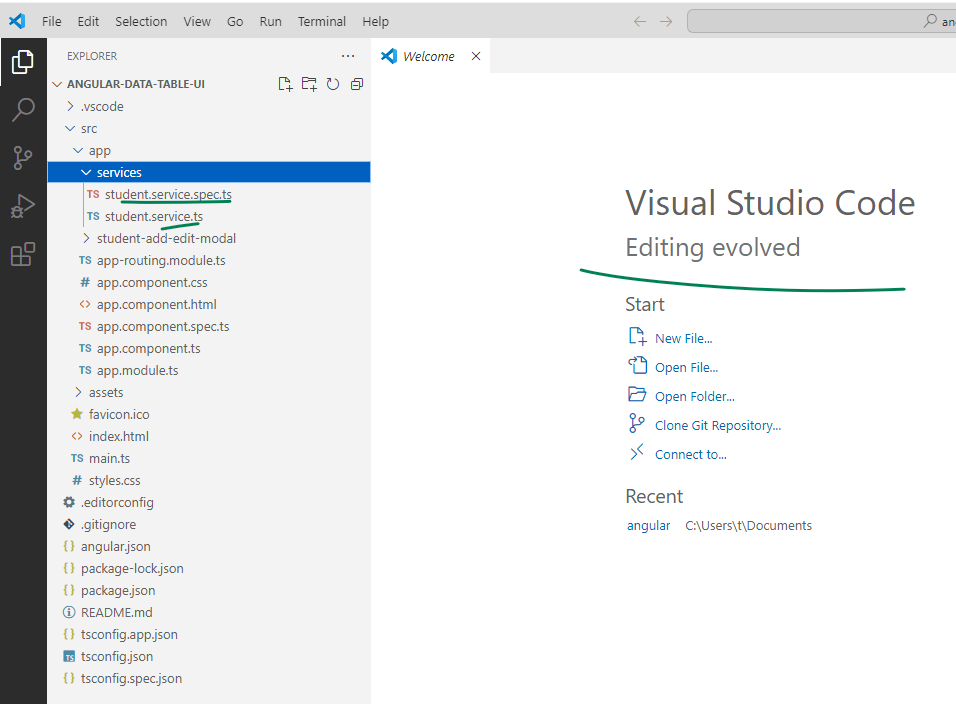 

#### make sure to have the spring api running in sts before running this project  

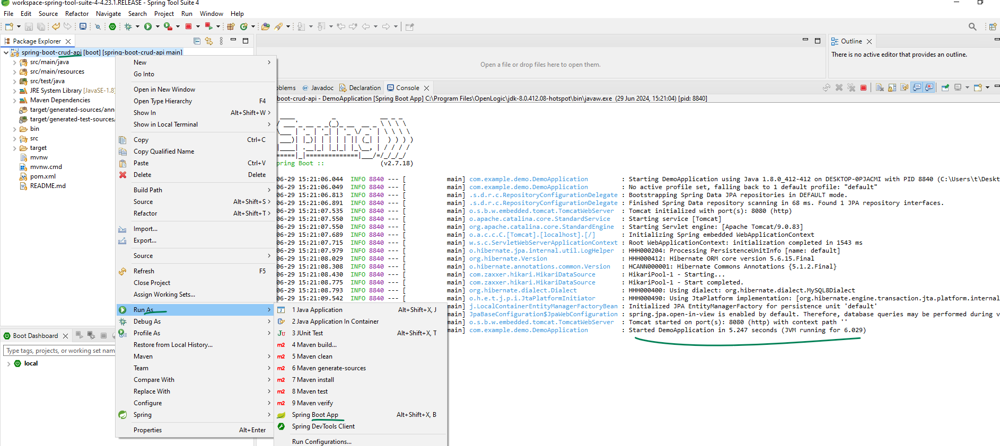 

#### edit the `src/app/services/student.service.ts` file, Uncomment the for windows line and comment the for ubuntu line to test the front end in local 

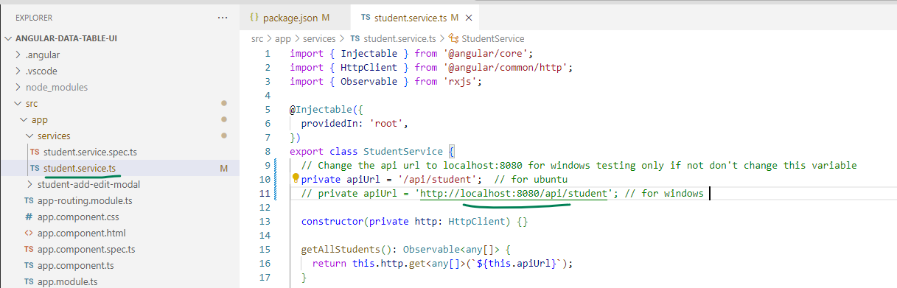 

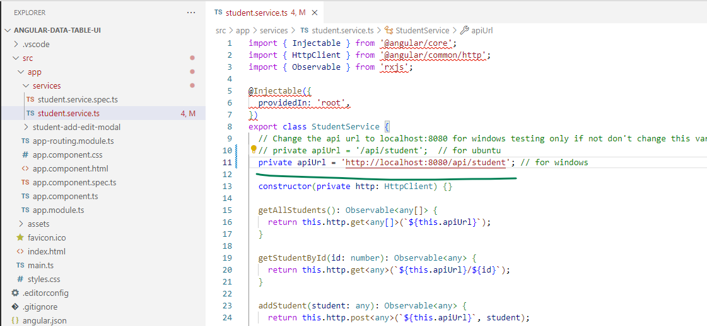 

#### you will see some errors in vscode those are expected as the code can't find the libraries and dependencies needed. so lets install them
  ##### open a new terminal in your angular project and run this command `npm install .`
  #### verify the local angular version this should be different from global 18, this is 16 for the project `ng version`

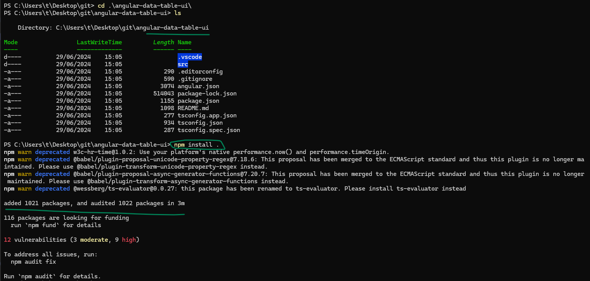 

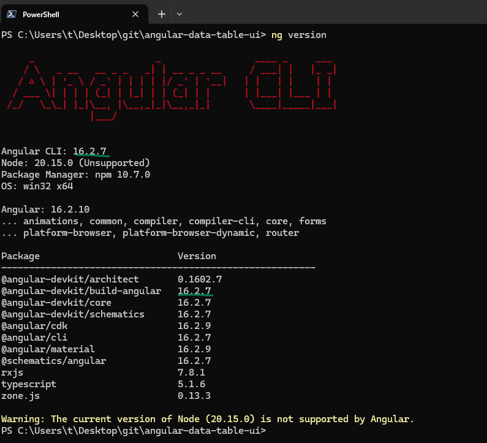 

  

#### Now lets serve the project with this command `ng serve --host 0.0.0.0` and access in the browser with `localhost:4200`

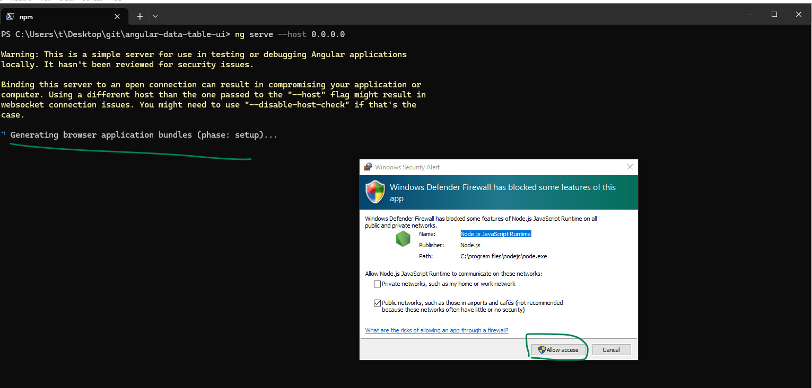 

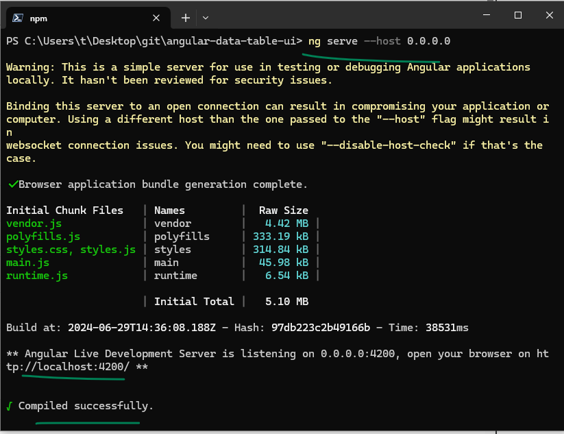 

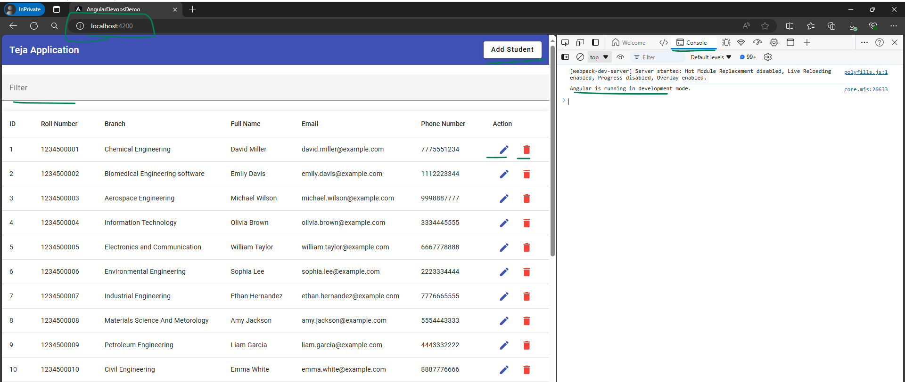 

## [Validate the Webpage](../01_validate_front_end/index.md)
