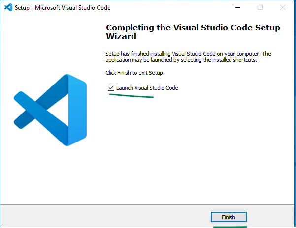

## Install VScode
Download the exe from this    

[https://vscode.download.prss.microsoft.com/dbazure/download/stable/5437499feb04f7a586f677b155b039bc2b3669eb/VSCodeSetup-x64-1.90.2.exe](https://vscode.download.prss.microsoft.com/dbazure/download/stable/5437499feb04f7a586f677b155b039bc2b3669eb/VSCodeSetup-x64-1.90.2.exe)  

if the above link doesn't work then manually visit this link and download the system installer x64 of vscode
[https://code.visualstudio.com/#alt-downloads](https://code.visualstudio.com/#alt-downloads)  

 

 

 

 

 

 

 

 

