### Once you have served the Application visit `localhost:4200` in your browser

#### Add a student and check the logs of angular, spring and check database if the addition is working

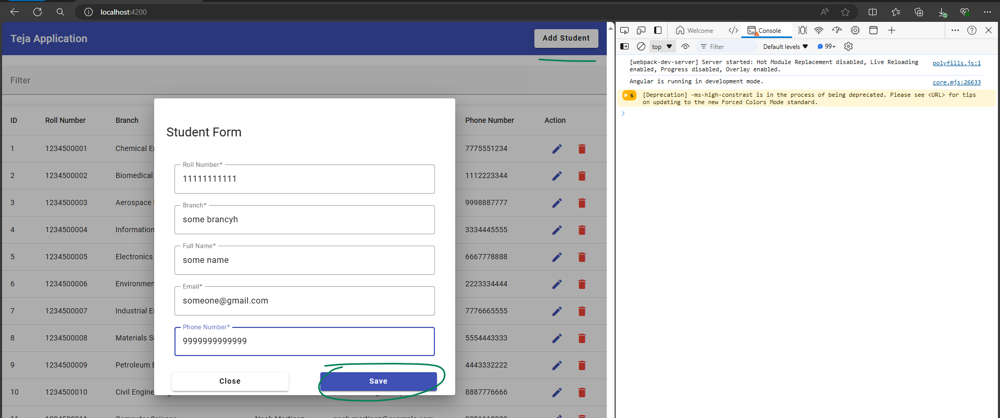 

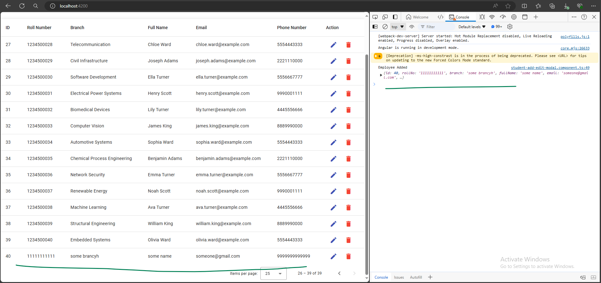 

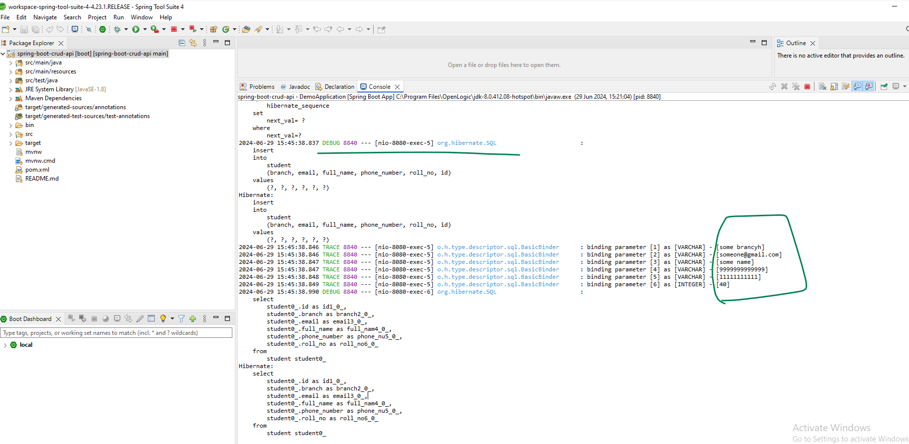 

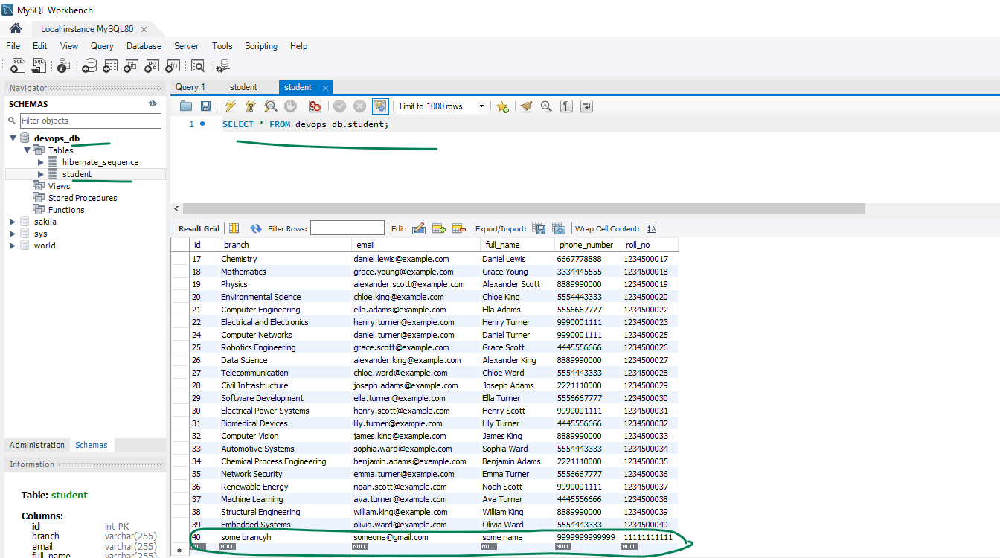 

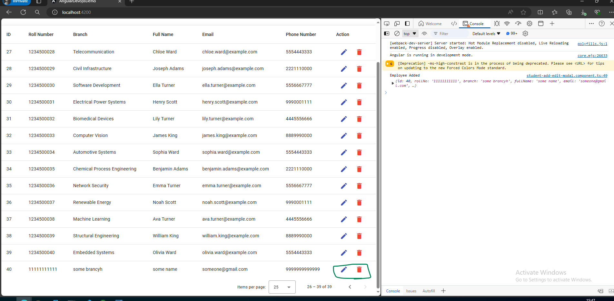 

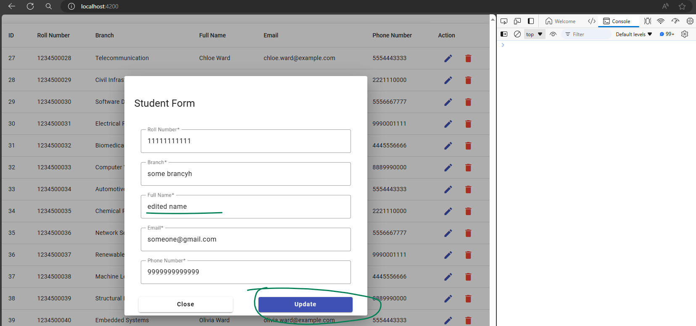 

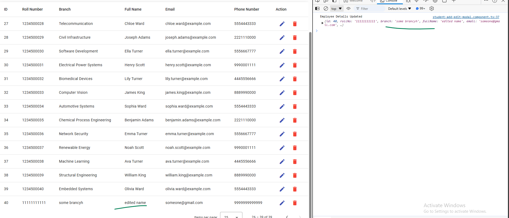 

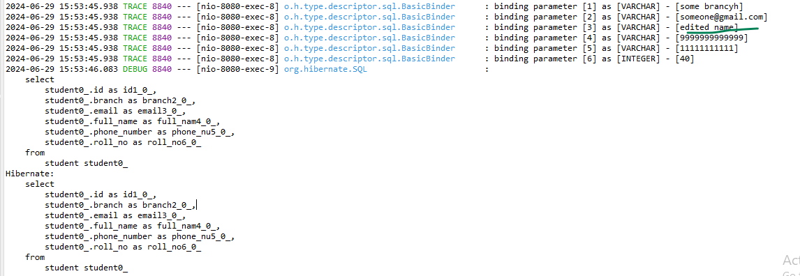 

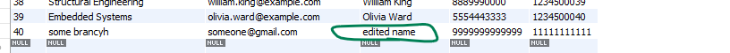 

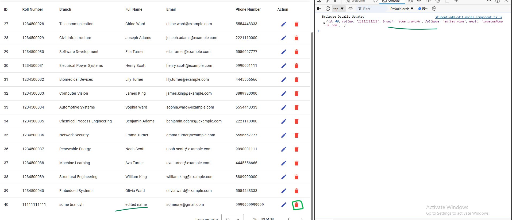 

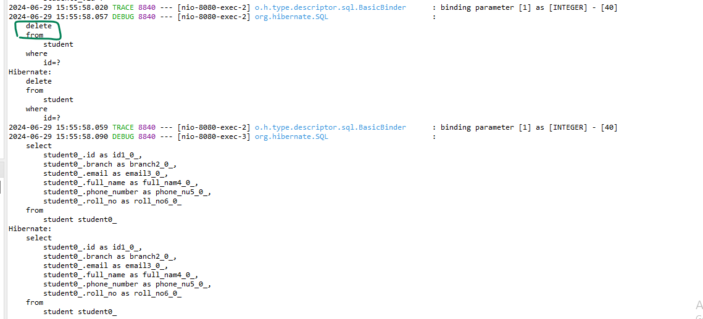 

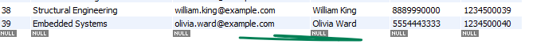 

