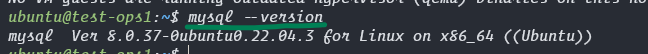
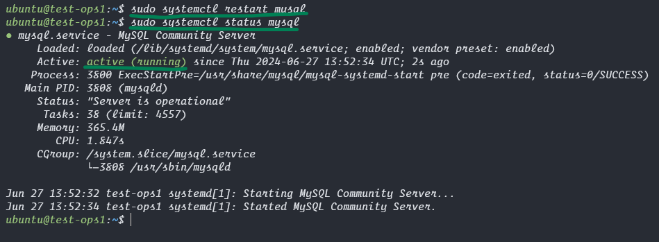
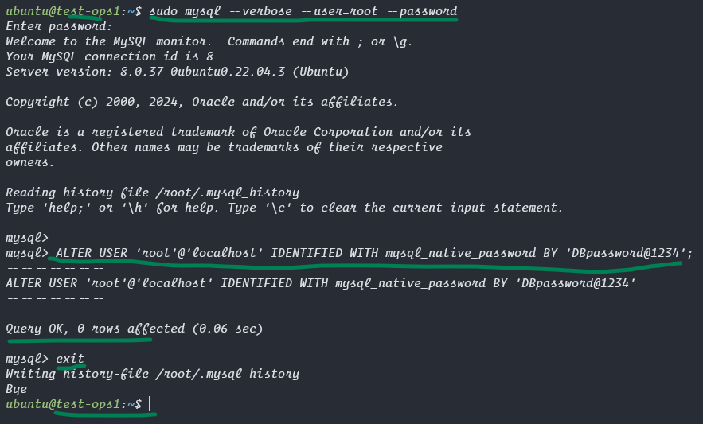
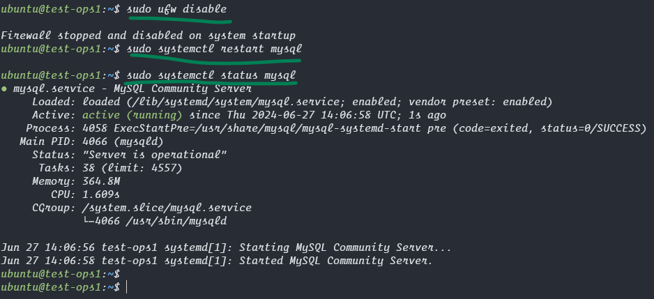
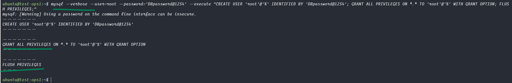
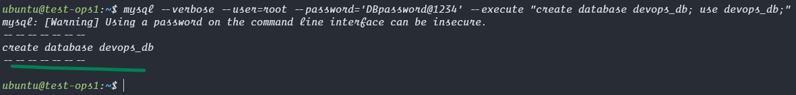
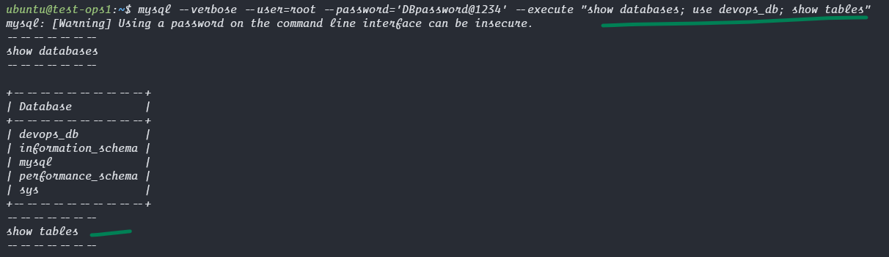
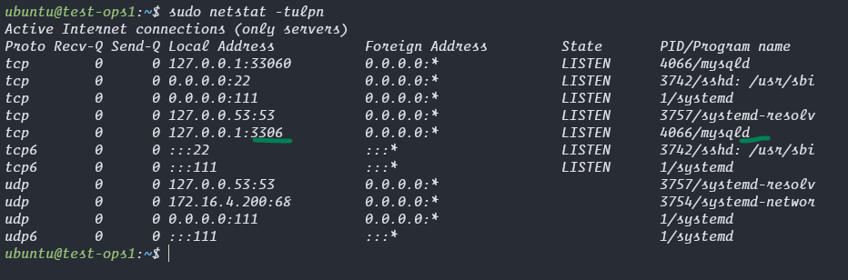

### Install Mysql in ubuntu
```bash
# run these commands in terminal below screenshot for reference.
sudo apt update
sudo apt install mysql-server net-tools -y
mysql --version
```




### Create login credentials for mysql database

```bash
# view the status of mysql service.
sudo systemctl restart mysql
sudo systemctl status mysql

# Run the below command once to enter mysql command line to create password for our database.
sudo mysql --verbose --user=root --password
# when asks for Enter password: 
# just hit enter, by default no password is there, we will create now.
ALTER USER 'root'@'localhost' IDENTIFIED WITH mysql_native_password BY 'DBpassword@1234';
# here the username is root and password is DBpassword@1234

# exit from mysql session
exit
```




### Allow root user in mysql to have full access of database

```bash
# disable firewall 
sudo ufw disable

# restart services and verify the status.
sudo systemctl restart mysql
sudo systemctl status mysql

# run the below command directly, no need to shift to mysql cmdline
mysql --verbose --user=root --password='DBpassword@1234' --execute "CREATE USER 'root'@'%' IDENTIFIED BY 'DBpassword@1234'; GRANT ALL PRIVILEGES ON *.* TO 'root'@'%' WITH GRANT OPTION; FLUSH PRIVILEGES;"

# Step 4
mysql --verbose --user=root --password='DBpassword@1234' --execute "create database devops_db; use devops_db;"

# Step 6
# show all databases in mysql and see what tables are in our database, currently it should be empty.
mysql --verbose --user=root --password='DBpassword@1234' --execute "show databases; use devops_db; show tables;"

# check the ports opened in our vm.
sudo netstat -tulpn
# if getting error or no output run the below command to install
# sudo apt install net-tools -y

```







## We are done with Mysql setup, now Create a Java API using this database with above credentials
