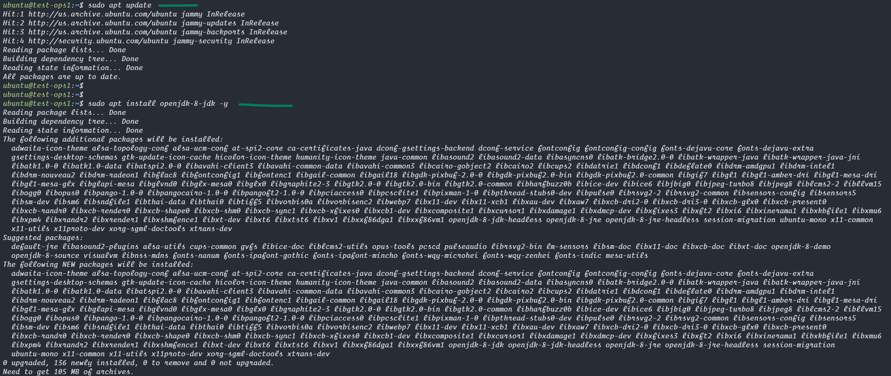
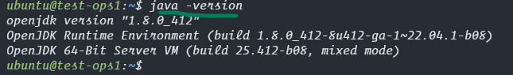
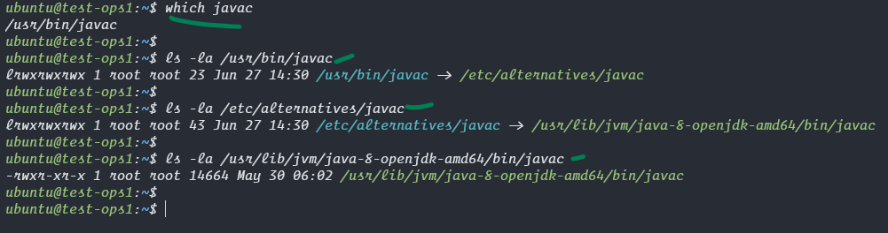
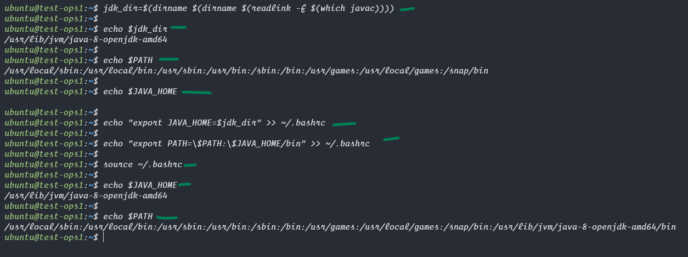

### Install Java in Ubuntu
```bash
sudo apt update
sudo apt install openjdk-8-jdk -y 

# verify java version
java -version
```




### Set JAVA_HOME Environment Variable

```bash
# JAVA_HOME environment variable is important because many Java-based applications such as Apache Tomcat, Maven, Gradle use this variable to JDK installed path..

# get the path of java installation
which javac
# check if the file is a link or a file
ls -la /usr/bin/javac

ls -la /etc/alternatives/javac

ls -la /usr/lib/jvm/java-8-openjdk-amd64/bin/javac

# so our javac is actually installed in this path we need to set this as the Java home path

# lets get that path only with this command here -f means follow all links till reaching the final path
jdk_dir=$(dirname $(dirname $(readlink -f $(which javac))))

# verify the path you got is correct.
echo $jdk_dir

# check path and java home before setting them.
echo $PATH
echo $JAVA_HOME


# set java home variable
echo "export JAVA_HOME=$jdk_dir" >> ~/.bashrc

# add java home to path variable
echo "export PATH=\$PATH:\$JAVA_HOME/bin" >> ~/.bashrc

# Apply the changes
source ~/.bashrc

# Print the JAVA_HOME and PATH environment variable
echo $JAVA_HOME
echo $PATH
```





## We are done installing java and setting java_home paths, now we can work with java applications.
