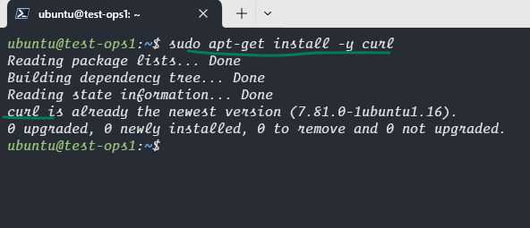
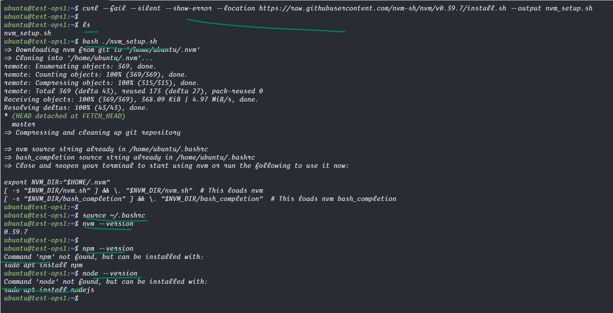
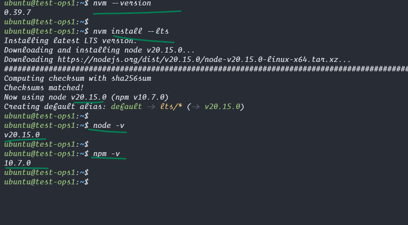

## Lets install Node js in Ubuntu

```bash
sudo apt-get install -y curl

# installs nvm (Node Version Manager)
curl --fail --silent --show-error --location https://raw.githubusercontent.com/nvm-sh/nvm/v0.39.7/install.sh --output nvm_setup.sh
bash nvm_setup.sh

source ~/.bashrc

# download and install Node.js (you may need to restart the terminal or source your bashrc to start nvm)
nvm install --lts

# verifies the right Node.js version is in the environment
node -v # should print `v20.15.0`

# verifies the right NPM version is in the environment
npm -v # should print `10.7.0`
```


<hr>


<hr>


<hr>

