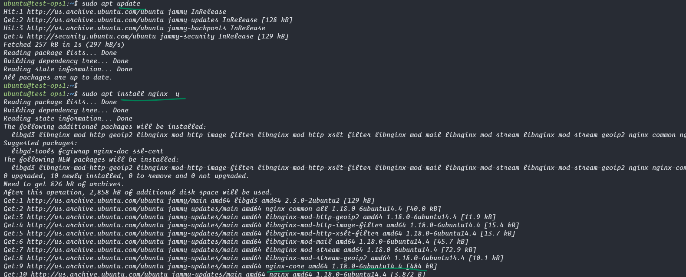
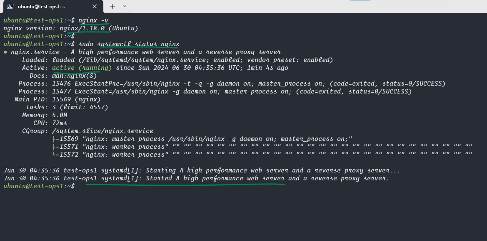
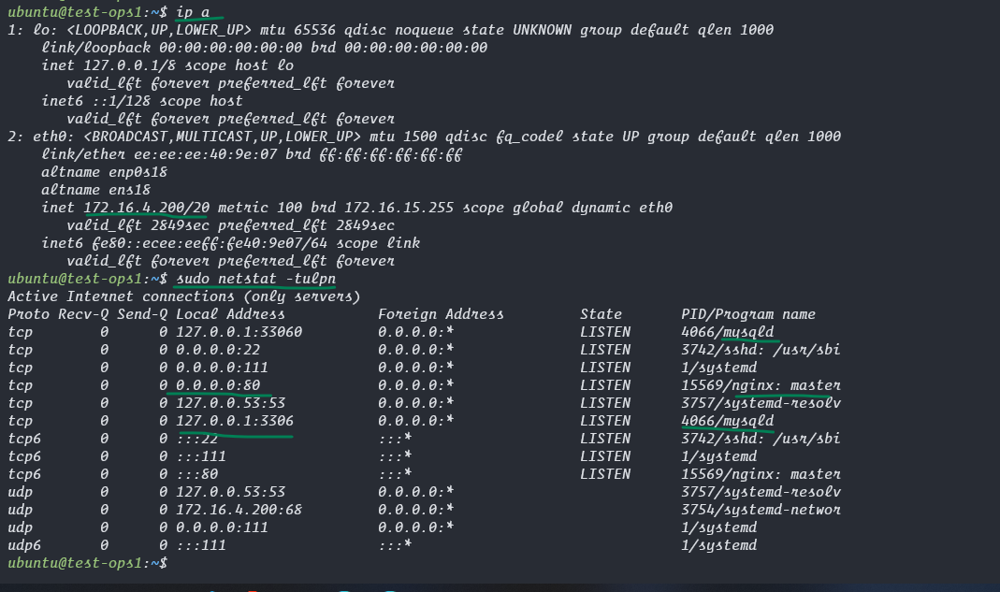
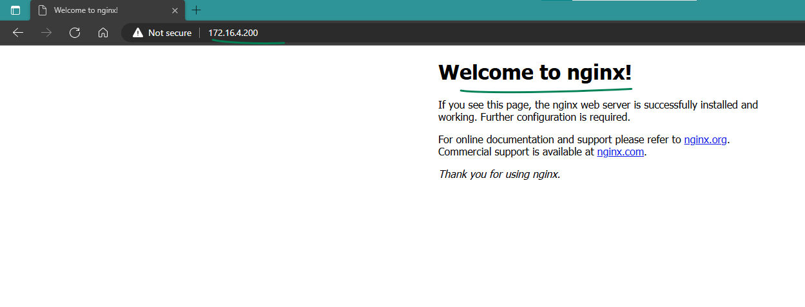

### Lets install a Webserver to deploy our frontend and create a working website

```bash
sudo apt update
sudo apt install nginx -y
nginx -v

sudo systemctl status nginx
```


<hr>


<hr>

### Lets Verify if our webserver is working visit `<ipaddress>` in your browser and see this.


<hr>


<hr>

