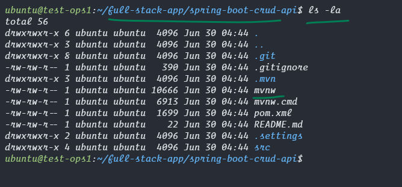

## Now we have a Virtual Machine that has all the necessary tools installed we can deploy our full stack application in this the same way we did in our windows machine.


### Verify Database is up and running
```bash
mysql --verbose --user=root --password='DBpassword@1234' --execute "show databases; use devops_db; show tables"
# we should have a working devops_db and no data in it.
```


<hr>

### Clone our Spring application

```bash
# Clone the git repo with the crud api
mkdir ~/full-stack-app
cd ~/full-stack-app

git clone https://github.com/Professor-Paradox/spring-boot-crud-api.git

cd spring-boot-crud-api
ls
# check the database name, username and password are correct in this application.properties file
cat --number src/main/resources/application.properties

```


<hr>


<hr>

### Build java application with maven

```bash
# make sure you are in the spring boot project folder if not cd to it.
ls -la

# make the maven wrapper a executable
chmod +x ./mvnw
ls -la

# this will create a jar file in the target diretory
./mvnw clean install package -DskipTests

# lets move the built jar file to a system path to deploy
ls -la target/
sudo mkdir --parents /opt/spring-boot

sudo cp ./target/demo-0.0.1-SNAPSHOT.jar /opt/spring-boot/ROOT.jar

ls -la /opt/spring-boot/
```


<hr>


<hr>


<hr>


<hr>


<hr>

### Deploy our Java Tomcat Spring Application
```bash
# now that we have the self contained jar file with tomcat and spring built and set we can create a system service that runs this jar file in background run this code copy paste 

sudo chmod -R 755 /opt/spring-boot/

# Create a systemd service to start this jar file on startup
sudo tee /etc/systemd/system/spring-boot.service << EOF > /dev/null
[Unit]
Description=Spring Boot Application
After=network.target

[Service]
User=ubuntu
ExecStart=/usr/bin/java -jar /opt/spring-boot/ROOT.jar
SuccessExitStatus=143
StandardOutput=file:/opt/spring-boot/maven-access.log
StandardError=file:/opt/spring-boot/maven-error.log

[Install]
WantedBy=multi-user.target
EOF

sudo systemctl daemon-reload
sudo systemctl enable --now spring-boot

# check if the service is running in background
sudo systemctl status spring-boot

# check if all ports are running
sudo netstat -tulpn

# check logs with this
sudo cat /opt/spring-boot/maven-access.log

# verify database if student table is created
mysql --verbose --user=root --password='DBpassword@1234' --execute "use devops_db; show tables"
```


<hr>


<hr>


<hr>


<hr>

## Our Backend is successfull Lets insert some data to our database
```bash
apiUrl="http://localhost:8080/api/student/bulk"

students='[
    {"rollNo": "1234500001", "branch": "Chemical Engineering", "fullName": "David Miller", "email": "david.miller@example.com", "phoneNumber": "7775551234"},
    {"rollNo": "1234500002", "branch": "Biomedical Engineering", "fullName": "Emily Davis", "email": "emily.davis@example.com", "phoneNumber": "1112223344"},
    {"rollNo": "1234500003", "branch": "Aerospace Engineering", "fullName": "Michael Wilson", "email": "michael.wilson@example.com", "phoneNumber": "9998887777"},
    {"rollNo": "1234500004", "branch": "Information Technology", "fullName": "Olivia Brown", "email": "olivia.brown@example.com", "phoneNumber": "3334445555"},
    {"rollNo": "1234500005", "branch": "Electronics and Communication", "fullName": "William Taylor", "email": "william.taylor@example.com", "phoneNumber": "6667778888"},
    {"rollNo": "1234500006", "branch": "Environmental Engineering", "fullName": "Sophia Lee", "email": "sophia.lee@example.com", "phoneNumber": "2223334444"},
    {"rollNo": "1234500007", "branch": "Industrial Engineering", "fullName": "Ethan Hernandez", "email": "ethan.hernandez@example.com", "phoneNumber": "7776665555"},
    {"rollNo": "1234500008", "branch": "Materials Science", "fullName": "Ava Jackson", "email": "ava.jackson@example.com", "phoneNumber": "5554443333"},
    {"rollNo": "1234500009", "branch": "Petroleum Engineering", "fullName": "Liam Garcia", "email": "liam.garcia@example.com", "phoneNumber": "4443332222"},
    {"rollNo": "1234500010", "branch": "Civil Engineering", "fullName": "Emma White", "email": "emma.white@example.com", "phoneNumber": "8887776666"},
    {"rollNo": "1234500011", "branch": "Computer Science", "fullName": "Noah Martinez", "email": "noah.martinez@example.com", "phoneNumber": "2221110000"},
    {"rollNo": "1234500012", "branch": "Mechanical Engineering", "fullName": "Isabella Adams", "email": "isabella.adams@example.com", "phoneNumber": "5556667777"},
    {"rollNo": "1234500013", "branch": "Electrical Engineering", "fullName": "James Harris", "email": "james.harris@example.com", "phoneNumber": "9990001111"},
    {"rollNo": "1234500014", "branch": "Software Engineering", "fullName": "Mia Robinson", "email": "mia.robinson@example.com", "phoneNumber": "4445556666"},
    {"rollNo": "1234500015", "branch": "Biotechnology", "fullName": "Benjamin Turner", "email": "benjamin.turner@example.com", "phoneNumber": "7778889999"},
    {"rollNo": "1234500016", "branch": "Automobile Engineering", "fullName": "Charlotte Hall", "email": "charlotte.hall@example.com", "phoneNumber": "1112223333"},
    {"rollNo": "1234500017", "branch": "Chemistry", "fullName": "Daniel Lewis", "email": "daniel.lewis@example.com", "phoneNumber": "6667778888"},
    {"rollNo": "1234500018", "branch": "Mathematics", "fullName": "Grace Young", "email": "grace.young@example.com", "phoneNumber": "3334445555"},
    {"rollNo": "1234500019", "branch": "Physics", "fullName": "Alexander Scott", "email": "alexander.scott@example.com", "phoneNumber": "8889990000"},
    {"rollNo": "1234500020", "branch": "Environmental Science", "fullName": "Chloe King", "email": "chloe.king@example.com", "phoneNumber": "5554443333"},
    {"rollNo": "1234500022", "branch": "Computer Engineering", "fullName": "Ella Adams", "email": "ella.adams@example.com", "phoneNumber": "5556667777"},
    {"rollNo": "1234500023", "branch": "Electrical and Electronics", "fullName": "Henry Turner", "email": "henry.turner@example.com", "phoneNumber": "9990001111"},
    {"rollNo": "1234500024", "branch": "Mechanical Design", "fullName": "Sophie Adams", "email": "sophie.adams@example.com", "phoneNumber": "5556667777"},
    {"rollNo": "1234500025", "branch": "Computer Networks", "fullName": "Daniel Turner", "email": "daniel.turner@example.com", "phoneNumber": "9990001111"},
    {"rollNo": "1234500026", "branch": "Robotics Engineering", "fullName": "Grace Scott", "email": "grace.scott@example.com", "phoneNumber": "4445556666"},
    {"rollNo": "1234500027", "branch": "Data Science", "fullName": "Alexander King", "email": "alexander.king@example.com", "phoneNumber": "8889990000"},
    {"rollNo": "1234500028", "branch": "Telecommunication", "fullName": "Chloe Ward", "email": "chloe.ward@example.com", "phoneNumber": "5554443333"},
    {"rollNo": "1234500029", "branch": "Civil Infrastructure", "fullName": "Joseph Adams", "email": "joseph.adams@example.com", "phoneNumber": "2221110000"},
    {"rollNo": "1234500030", "branch": "Software Development", "fullName": "Ella Turner", "email": "ella.turner@example.com", "phoneNumber": "5556667777"},
    {"rollNo": "1234500031", "branch": "Electrical Power Systems", "fullName": "Henry Scott", "email": "henry.scott@example.com", "phoneNumber": "9990001111"},
    {"rollNo": "1234500032", "branch": "Biomedical Devices", "fullName": "Lily Turner", "email": "lily.turner@example.com", "phoneNumber": "4445556666"},
    {"rollNo": "1234500033", "branch": "Computer Vision", "fullName": "James King", "email": "james.king@example.com", "phoneNumber": "8889990000"},
    {"rollNo": "1234500034", "branch": "Automotive Systems", "fullName": "Sophia Ward", "email": "sophia.ward@example.com", "phoneNumber": "5554443333"},
    {"rollNo": "1234500035", "branch": "Chemical Process Engineering", "fullName": "Benjamin Adams", "email": "benjamin.adams@example.com", "phoneNumber": "2221110000"},
    {"rollNo": "1234500036", "branch": "Network Security", "fullName": "Emma Turner", "email": "emma.turner@example.com", "phoneNumber": "5556667777"},
    {"rollNo": "1234500037", "branch": "Renewable Energy", "fullName": "Noah Scott", "email": "noah.scott@example.com", "phoneNumber": "9990001111"},
    {"rollNo": "1234500038", "branch": "Machine Learning", "fullName": "Ava Turner", "email": "ava.turner@example.com", "phoneNumber": "4445556666"},
    {"rollNo": "1234500039", "branch": "Structural Engineering", "fullName": "William King", "email": "william.king@example.com", "phoneNumber": "8889990000"},
    {"rollNo": "1234500040", "branch": "Embedded Systems", "fullName": "Olivia Ward", "email": "olivia.ward@example.com", "phoneNumber": "5554443333"}
]'

curl --request POST --header 'Content-Type: application/json' --data "$students" "$apiUrl"

# we inserted data in to this db with api, verify that
mysql --verbose --user=root --password='DBpassword@1234' --execute "select * devops_db.student"

# get all the same api data to test get method also
curl --request GET "http://localhost:8080/api/student"
```


<hr>


<hr>


<hr>


### Lets Clone our frontend repo
```bash
# lets clone our angular application from git
cd ~
cd full-stack-app
ls -la
git clone https://github.com/Professor-Paradox/angular-data-table-ui.git
ls -la
cd angular-data-table-ui
ls
```


<hr>

### Setup Angular 
```bash
ls -la 
npm -v

# install angular
npm install --global @angular/cli@v18
ng version

# install project modules
npm install .
ng v # should show 16 as the project uses that version
ls -la # will have a node_modules folder with all the data
```


<hr>


<hr>


<hr>


<hr>


<hr>

### Build Angular App to Generate `HTML, CSS, JAVASCRIPT` files
```bash
# Verify the appurl is to /api of ubuntu not windows
cat --number src/app/services/student.service.ts

# now lets build the angular app
ls
ng build --progress --configuration=production
# all the built files will be put in dist folder we can copy them to the nginx webserver to deploy

ls -la dist/angular_devops_demo/
```


<hr>


<hr>

### Deploy our webpages to nginx
```bash
# lets move the files we generated to nginx html folder to deploy them.
ls -la /var/www/html
sudo cp --recursive dist/angular_devops_demo/* /var/www/html
sudo chmod --recursive +rx /var/www/html 
ls -la /var/www/html

# don't miss the 'EOF' quotes that makes the config a literal string, we need the $uri as it is in the config as it is expanded by nginx not shell script.
sudo tee /etc/nginx/sites-enabled/default << 'EOF' > /dev/null
server {
  listen 80 default_server;
  listen [::]:80 default_server;

  root /var/www/html;

  index index.html index.htm;

  server_name _;

  location / {
    try_files $uri $uri/ /index.html =404;
    add_header 'Access-Control-Allow-Origin' '*';
    add_header 'Access-Control-Allow-Methods' 'GET, POST, PUT, DELETE, OPTIONS';
    add_header 'Access-Control-Allow-Headers' 'DNT,User-Agent,X-Requested-With,If-Modified-Since,Cache-Control,Content-Type,Range,Authorization';
  }
  
  location /api/ {
    proxy_pass http://localhost:8080;
  }
}
EOF


# restart the service
sudo systemctl restart nginx

# view nginx status
sudo systemctl status nginx

# check all services are running correctly by checking if there respective ports are still being used.
sudo netstat -tulpn
```

## Access our full stack app in browser with the vm ip directly


<hr>


<hr>


<hr>


<hr>
