## Lets install Jenkins and its dependencies in a new VM for controlling our first vm.

#### we need openjdk for this jenkins takes care of it.
```bash
sudo curl --fail --silent --show-error --location https://pkg.jenkins.io/debian-stable/jenkins.io-2023.key --output /usr/share/keyrings/jenkins-keyring.asc
echo "deb [signed-by=/usr/share/keyrings/jenkins-keyring.asc]" https://pkg.jenkins.io/debian-stable binary/ | sudo tee /etc/apt/sources.list.d/jenkins.list > /dev/null
sudo apt update 
sudo apt install fontconfig openjdk-17-jre -y
java -version

sudo apt install net-tools jenkins -y

sudo systemctl enable --now jenkins
sudo systemctl restart jenkins
sudo systemctl status jenkins

# check if jenkins is accessible from port 8080
sudo netstat -tulpn

```


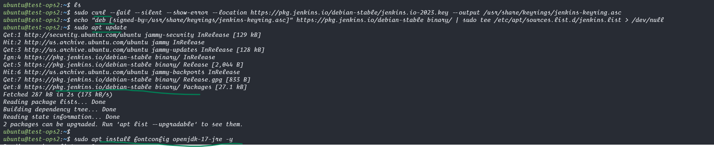
<hr>
 
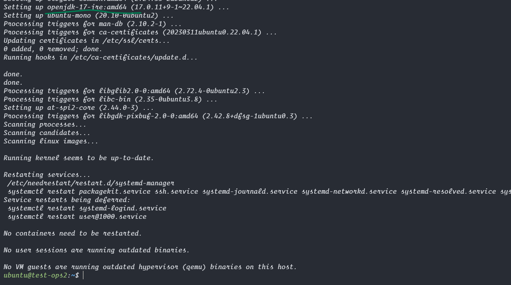
<hr>
 
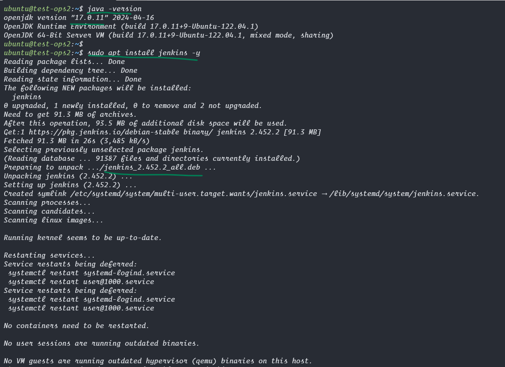
<hr>
 
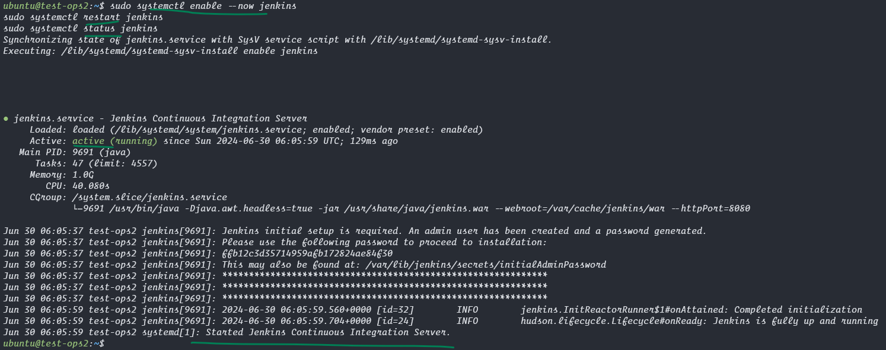
<hr>
 
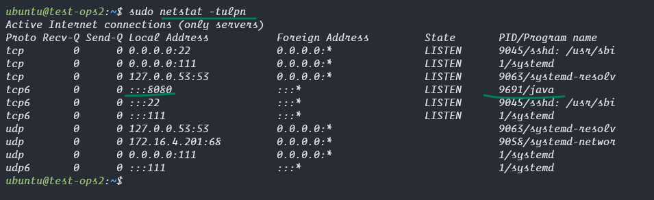
<hr>

#### Visit the Jenkins webpage from `vm_ip:8080` in a browser and configure the jenkins setup from this  
If asks for a password run in your vm 
`sudo cat /var/lib/jenkins/secrets/initialAdminPassword`

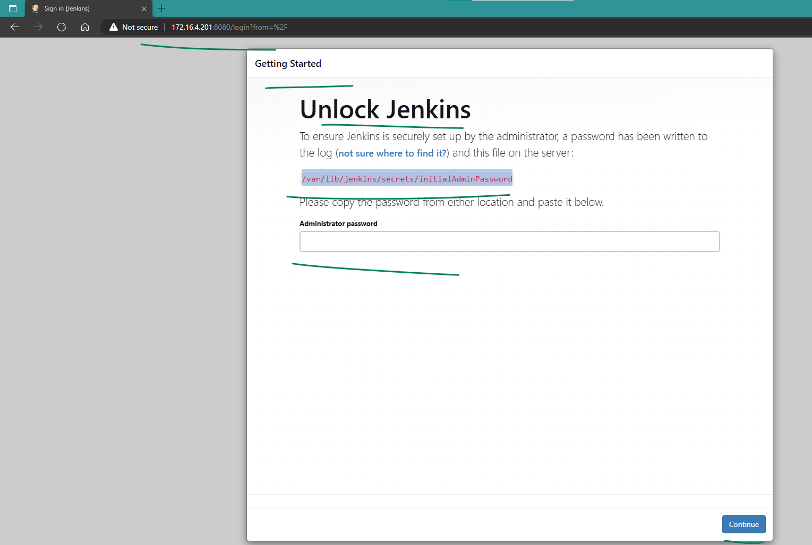
<hr>
 
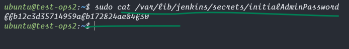
<hr>

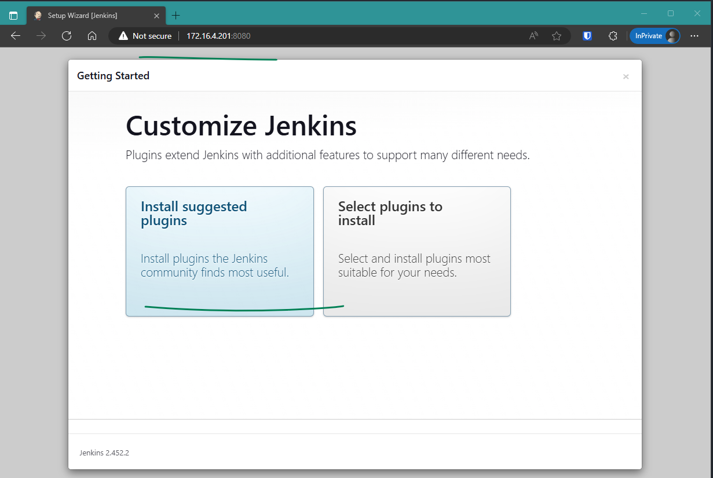
<hr>
 
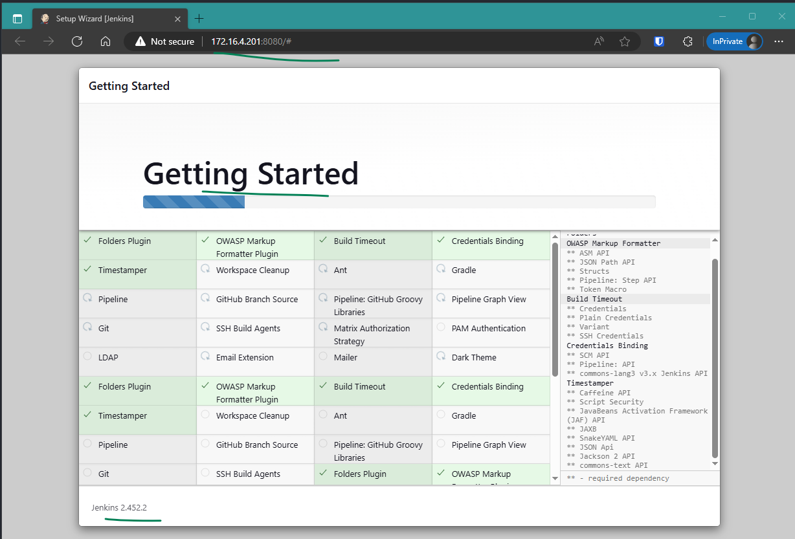
<hr>
 
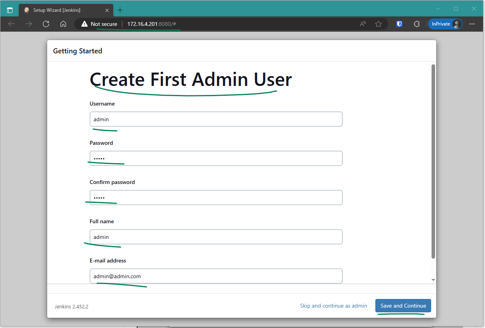
<hr>
 
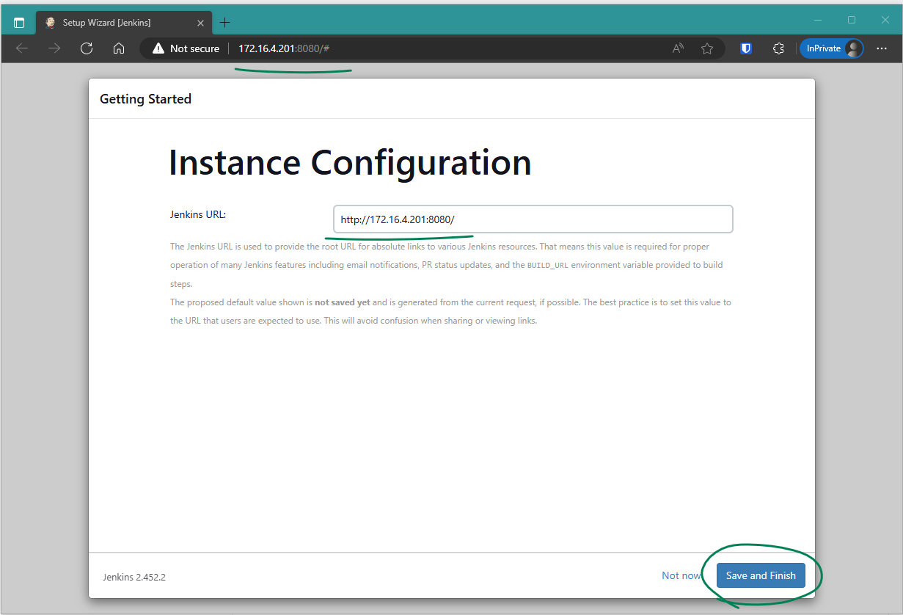
<hr>
 
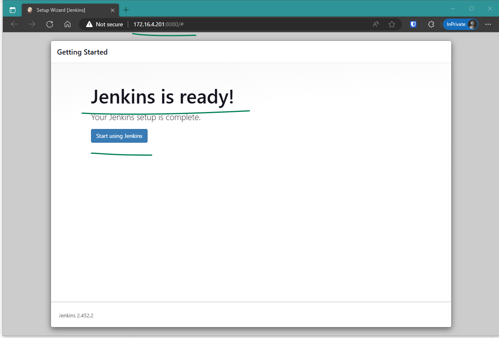
<hr>
 
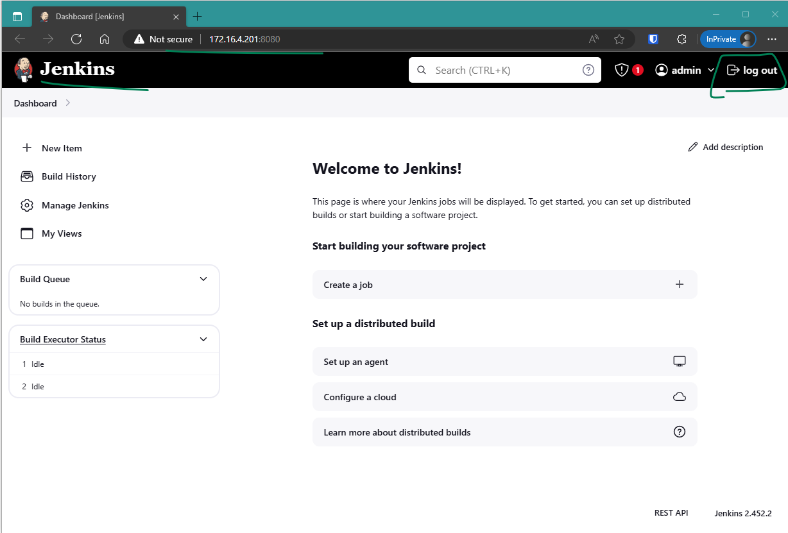
<hr>
 
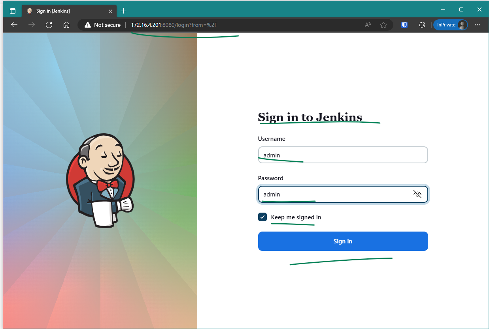
<hr>
 
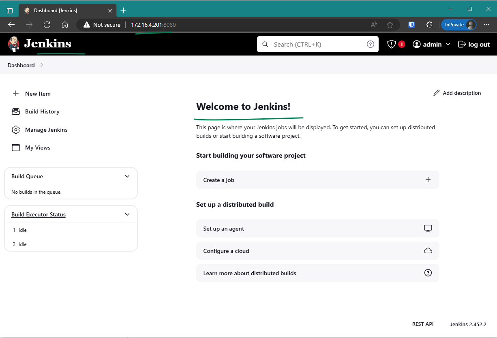
<hr>
