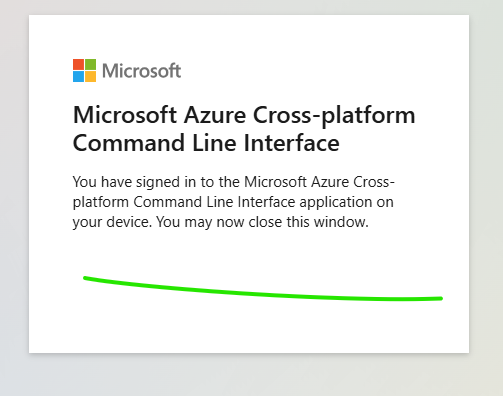
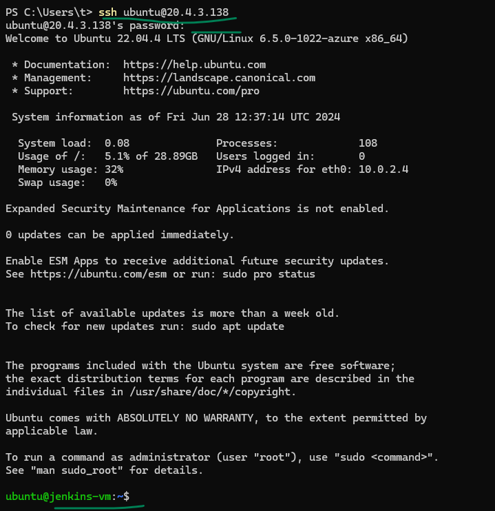

### lets create Terraform config to create two virtual machines in Azure

```bash
# first login to azure using the account you created.
az login --use-device-code
# this will give you a link and code to enter, open the link and paste code and login with your azure account 

# verify that az cli has access to your account with this command
az account show

# now we can create vms with terraform now.
```





### without logging in to azure if you continue to work with terraform will get errors like this.


### Copy this code in to a main tf file and then run terraform commands below

```hcl
terraform {
  required_version = ">=1.8"
  required_providers {
    azurerm = {
      source  = "hashicorp/azurerm"
      version = ">=3.110"
    }
  }
}

provider "azurerm" {
  skip_provider_registration = true
  features {}
}

# Create a resource group
resource "azurerm_resource_group" "example-rg" {
  name     = "example-rg"
  location = "West Europe"
}

# Create a Virtual Network to have ip address for the vm.
resource "azurerm_virtual_network" "example-vnet" {
  name                = "example-vnet"
  address_space       = ["10.0.0.0/16"]
  location            = azurerm_resource_group.example-rg.location
  resource_group_name = azurerm_resource_group.example-rg.name
}

# Create Firewall Rules for this virtual network
# By default allowing everything for development purposes

resource "azurerm_network_security_group" "example-nsg" {
  name                = "example-nsg"
  location            = azurerm_resource_group.example-rg.location
  resource_group_name = azurerm_resource_group.example-rg.name

  security_rule {
    name                       = "AllowAllInBound"
    priority                   = 100
    access                     = "Allow"
    direction                  = "Inbound"
    protocol                   = "*"
    source_port_range          = "*"
    destination_port_range     = "*"
    source_address_prefix      = "*"
    destination_address_prefix = "*"
  }
}

# Create a subnet in above network
resource "azurerm_subnet" "example-subnet" {
  name                 = "example-subnet"
  resource_group_name  = azurerm_resource_group.example-rg.name
  virtual_network_name = azurerm_virtual_network.example-vnet.name
  address_prefixes     = ["10.0.2.0/24"]
}

# Link the Firewall rules to the Subnet
resource "azurerm_subnet_network_security_group_association" "example" {
  subnet_id                 = azurerm_subnet.example-subnet.id
  network_security_group_id = azurerm_network_security_group.example-nsg.id
}


# Create public ips for 2 vms
resource "azurerm_public_ip" "devops-vm-ip" {
  name                = "devops-vm-ip"
  resource_group_name = azurerm_resource_group.example-rg.name
  location            = azurerm_resource_group.example-rg.location
  allocation_method   = "Static"
}

resource "azurerm_public_ip" "jenkins-vm-ip" {
  name                = "jenkins-vm-ip"
  resource_group_name = azurerm_resource_group.example-rg.name
  location            = azurerm_resource_group.example-rg.location
  allocation_method   = "Static"
}

# Create NICs for two vms and attach above public ip to each
resource "azurerm_network_interface" "devops-vm-nic" {
  name                = "devops-vm-nic"
  location            = azurerm_resource_group.example-rg.location
  resource_group_name = azurerm_resource_group.example-rg.name

  ip_configuration {
    name                          = "internal"
    private_ip_address_allocation = "Dynamic"
    subnet_id                     = azurerm_subnet.example-subnet.id
    public_ip_address_id          = azurerm_public_ip.devops-vm-ip.id
  }
}

resource "azurerm_network_interface" "jenkins-vm-nic" {
  name                = "jenkins-vm-nic"
  location            = azurerm_resource_group.example-rg.location
  resource_group_name = azurerm_resource_group.example-rg.name

  ip_configuration {
    name                          = "internal"
    private_ip_address_allocation = "Dynamic"
    subnet_id                     = azurerm_subnet.example-subnet.id
    public_ip_address_id          = azurerm_public_ip.jenkins-vm-ip.id
  }
}

# Create 2 VMs
resource "azurerm_linux_virtual_machine" "devops-vm" {
  resource_group_name   = azurerm_resource_group.example-rg.name
  location              = azurerm_resource_group.example-rg.location
  network_interface_ids = [azurerm_network_interface.devops-vm-nic.id]

  name                            = "devops-vm"
  size                            = "Standard_B1s"
  admin_username                  = "ubuntu"
  admin_password                  = "Vmpassword@123"
  disable_password_authentication = false

  os_disk {
    caching              = "ReadWrite"
    storage_account_type = "Standard_LRS"
  }

  source_image_reference {
    publisher = "Canonical"
    offer     = "0001-com-ubuntu-server-jammy"
    sku       = "22_04-lts"
    version   = "latest"
  }
}

resource "azurerm_linux_virtual_machine" "jenkins-vm" {
  resource_group_name   = azurerm_resource_group.example-rg.name
  location              = azurerm_resource_group.example-rg.location
  network_interface_ids = [azurerm_network_interface.jenkins-vm-nic.id]

  name                            = "jenkins-vm"
  size                            = "Standard_B1s"
  admin_username                  = "ubuntu"
  admin_password                  = "Vmpassword@123"
  disable_password_authentication = false

  os_disk {
    caching              = "ReadWrite"
    storage_account_type = "Standard_LRS"
  }

  source_image_reference {
    publisher = "Canonical"
    offer     = "0001-com-ubuntu-server-jammy"
    sku       = "22_04-lts"
    version   = "latest"
  }
}

output "vm_summary" {
  value = {
    "devops-vm-ip"  = azurerm_linux_virtual_machine.devops-vm.public_ip_address,
    "jenkins-vm-ip" = azurerm_linux_virtual_machine.jenkins-vm.public_ip_address
  }
  description = "Summary of VM names, there Public IP addresses"
}

```

### Use Terraform to create vms

```bash
# lets start a terraform project
# go to a folder that can store your terraform data 
terraform init

# lets apply our config to create 2 vms in azure
terraform apply

# this will ask for confirmation make sure to read all the configs and only then type yes.

# once the vms are created then connect with windows terminal with the ip in the output
# the username and password are from the above config only.

```


## terraform plan


### Connect with Windows Terminal


