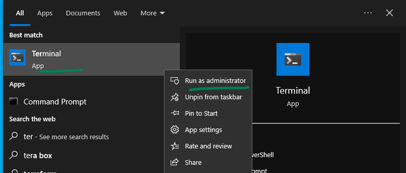
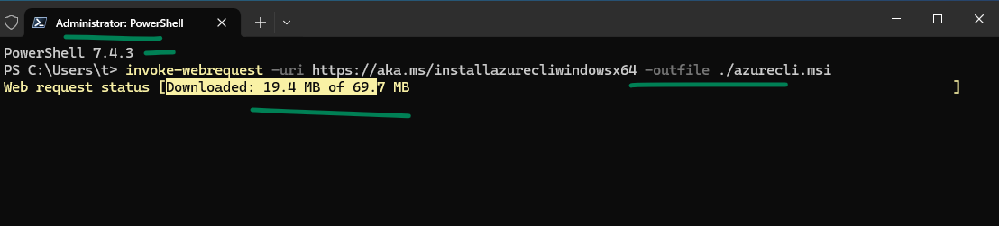
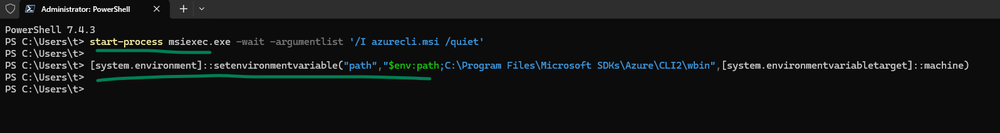
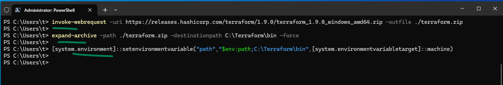
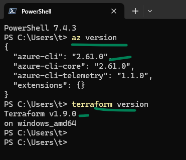

### Here we should manually 

1. Install powershell 7 from windows store
2. install windows terminal from windows store
3. set powershell 7 as the default

### Install Azure Cli
```powershell
# these are builtin powershell commands called commandlet
# this is similar to bash scripting but for windows.
# open terminal as admin
invoke-webrequest -uri https://aka.ms/installazurecliwindowsx64 -outfile ./azurecli.msi
start-process msiexec.exe -wait -argumentlist '/I azurecli.msi /quiet'
[system.environment]::setenvironmentvariable("path","$env:path;C:\Program Files\Microsoft SDKs\Azure\CLI2\wbin",[system.environmentvariabletarget]::machine)

```






### Install Terraform

```powershell
# continue from above section
invoke-webrequest -uri https://releases.hashicorp.com/terraform/1.9.0/terraform_1.9.0_windows_amd64.zip -outfile ./terraform.zip
expand-archive -path ./terraform.zip -destinationpath C:\Terraform\bin -force
[system.environment]::setenvironmentvariable("path","$env:path;C:\Terraform\bin",[system.environmentvariabletarget]::machine)
```


### verify the installed versions
close the terminal entirely and open again to verify
```bash
az --version
terraform --version
```

